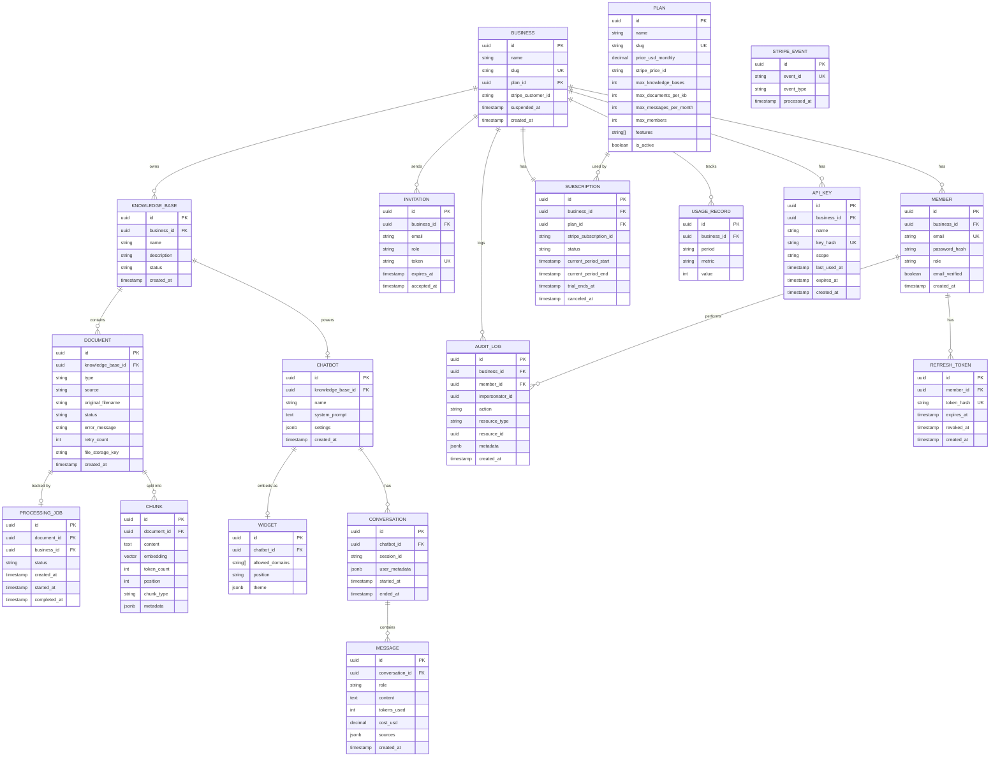
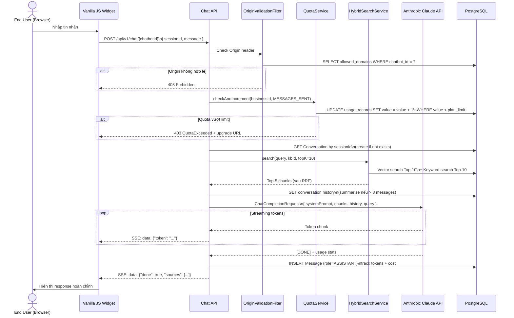
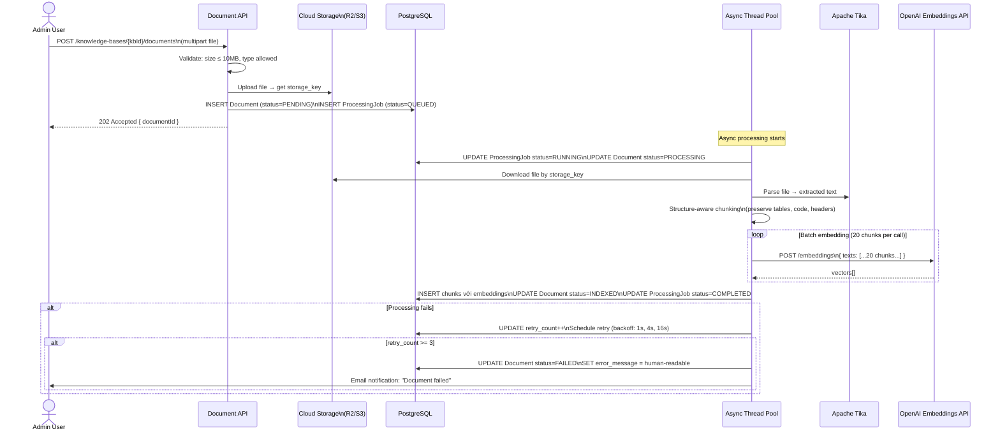
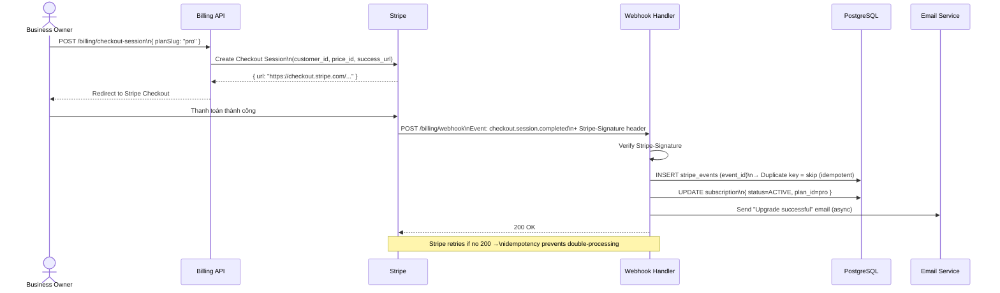

# UML Diagrams — spring-saas-support-ai

> Tất cả diagrams dùng Mermaid syntax — render trực tiếp trên GitHub.

---

## 1. Use Case Diagram

```mermaid
graph TB
    subgraph Actors
        OWNER([👤 Owner])
        ADMIN([👤 Admin])
        MEMBER([👤 Member])
        ENDUSER([👥 End User\nAnonymous])
        SUPERADMIN([🔐 Super Admin])
        STRIPE([💳 Stripe\nWebhook])
    end

    subgraph UC_AUTH ["Auth & Account"]
        UC1[Đăng ký Business]
        UC2[Đăng nhập]
        UC3[Refresh Token]
        UC4[Đổi mật khẩu]
        UC5[Verify Email]
    end

    subgraph UC_MEMBER ["Member Management"]
        UC6[Mời thành viên]
        UC7[Chấp nhận lời mời]
        UC8[Xóa thành viên]
        UC9[Đổi role thành viên]
        UC10[Xem danh sách thành viên]
    end

    subgraph UC_KB ["Knowledge Base"]
        UC11[Tạo Knowledge Base]
        UC12[Upload tài liệu]
        UC13[Xem trạng thái xử lý]
        UC14[Xóa tài liệu / KB]
        UC15[Reindex tài liệu]
    end

    subgraph UC_CHATBOT ["Chatbot & Widget"]
        UC16[Tạo Chatbot]
        UC17[Cấu hình Chatbot]
        UC18[Lấy embed code]
        UC19[Xem conversations]
        UC20[Xem analytics]
    end

    subgraph UC_CHAT ["Chat \(Public\)"]
        UC21[Gửi tin nhắn\n→ SSE stream]
        UC22[Xem lịch sử chat]
        UC23[Gửi feedback\n👍👎]
    end

    subgraph UC_BILLING ["Billing"]
        UC24[Xem plans]
        UC25[Upgrade / Checkout]
        UC26[Quản lý subscription]
        UC27[Xem hóa đơn]
        UC28[Xử lý webhook\nStripe]
    end

    subgraph UC_ADMIN ["Super Admin"]
        UC29[Xem tất cả businesses]
        UC30[Suspend business]
        UC31[Impersonate tenant]
    end

    %% Owner
    OWNER --> UC1
    OWNER --> UC2
    OWNER --> UC3
    OWNER --> UC4
    OWNER --> UC5
    OWNER --> UC6
    OWNER --> UC8
    OWNER --> UC9
    OWNER --> UC10
    OWNER --> UC11
    OWNER --> UC12
    OWNER --> UC13
    OWNER --> UC14
    OWNER --> UC15
    OWNER --> UC16
    OWNER --> UC17
    OWNER --> UC18
    OWNER --> UC19
    OWNER --> UC20
    OWNER --> UC24
    OWNER --> UC25
    OWNER --> UC26
    OWNER --> UC27

    %% Admin
    ADMIN --> UC2
    ADMIN --> UC6
    ADMIN --> UC10
    ADMIN --> UC11
    ADMIN --> UC12
    ADMIN --> UC13
    ADMIN --> UC14
    ADMIN --> UC15
    ADMIN --> UC16
    ADMIN --> UC17
    ADMIN --> UC18
    ADMIN --> UC19
    ADMIN --> UC20

    %% Member
    MEMBER --> UC2
    MEMBER --> UC10
    MEMBER --> UC13
    MEMBER --> UC19

    %% End User
    ENDUSER --> UC7
    ENDUSER --> UC21
    ENDUSER --> UC22
    ENDUSER --> UC23

    %% Super Admin
    SUPERADMIN --> UC29
    SUPERADMIN --> UC30
    SUPERADMIN --> UC31

    %% Stripe
    STRIPE --> UC28
```

---

## 2. Class Diagram

> Tập trung vào **Service layer** và các quan hệ chính. Entity classes được mô tả trong ER Diagram.

```mermaid
classDiagram

    %% ── Auth ──────────────────────────────────────────
    class AuthService {
        +signup(SignupRequest) : AuthResponse
        +login(LoginRequest) : AuthResponse
        +refresh(String refreshToken) : AuthResponse
        +logout(String refreshToken) void
        +forgotPassword(String email) void
        +resetPassword(ResetPasswordRequest) void
        +verifyEmail(String token) void
    }

    class JwtService {
        +generateAccessToken(Member) : String
        +generateRefreshToken(Member) : String
        +validateToken(String) : JwtClaims
        +isTokenRevoked(String jti) : boolean
        -storeRefreshTokenHash(UUID memberId, String token) void
    }

    class JwtAuthFilter {
        +doFilterInternal(request, response, chain) void
        -extractToken(request) : Optional~String~
    }

    class TenantContext {
        <<utility>>
        -currentTenant : ThreadLocal~UUID~
        +setTenantId(UUID) void
        +getTenantId() : UUID
        +clear() void
    }

    class TenantContextCopyingDecorator {
        +decorate(Runnable) : Runnable
    }

    AuthService --> JwtService
    JwtAuthFilter --> JwtService
    JwtAuthFilter --> TenantContext

    %% ── Member ────────────────────────────────────────
    class MemberService {
        +listMembers() : List~MemberDto~
        +inviteMember(InviteRequest) void
        +acceptInvitation(String token, String password) void
        +removeMember(UUID memberId) void
        +changeRole(UUID memberId, Role role) void
    }

    class InvitationService {
        +sendInvitation(UUID businessId, String email, Role) void
        +accept(String token, String password) : Member
        +validateToken(String token) : Invitation
    }

    MemberService --> InvitationService

    %% ── Knowledge Base ────────────────────────────────
    class KnowledgeBaseService {
        +create(CreateKbRequest) : KnowledgeBaseDto
        +list() : List~KnowledgeBaseDto~
        +getById(UUID) : KnowledgeBaseDto
        +update(UUID, UpdateKbRequest) : KnowledgeBaseDto
        +delete(UUID) void
        -enforceKbLimit() void
    }

    class DocumentService {
        +upload(UUID kbId, MultipartFile) : DocumentDto
        +ingestUrl(UUID kbId, String url) : DocumentDto
        +list(UUID kbId) : List~DocumentDto~
        +getById(UUID) : DocumentDto
        +delete(UUID) void
        +reindex(UUID) void
        +listChunks(UUID docId) : List~ChunkDto~
    }

    class DocumentProcessor {
        <<async>>
        +process(UUID documentId) void
        -parse(Document) : String
        -chunk(String content) : List~ChunkData~
        -embed(List~ChunkData~) : List~Chunk~
        -recover() void
    }

    class ChunkingService {
        +chunk(String content, DocumentType) : List~ChunkData~
        -splitParagraphs(String) : List~String~
        -preserveTables(String) : List~String~
        -preserveCodeBlocks(String) : List~String~
    }

    class EmbeddingService {
        +embed(List~String~ texts) : List~float[]~
    }

    class StorageService {
        +upload(MultipartFile) : String
        +delete(String key) void
        +getDownloadUrl(String key) : String
    }

    DocumentService --> StorageService
    DocumentService --> DocumentProcessor
    DocumentProcessor --> ChunkingService
    DocumentProcessor --> EmbeddingService
    KnowledgeBaseService --> DocumentService

    %% ── Chat ──────────────────────────────────────────
    class ChatService {
        +streamChat(UUID chatbotId, ChatRequest, SseEmitter) void
        +getHistory(UUID chatbotId, String sessionId) : List~MessageDto~
        +submitFeedback(FeedbackRequest) void
        -retrieveContext(String query, UUID kbId) : List~Chunk~
        -buildPrompt(List~Chunk~, List~Message~) : String
        -trackUsage(UUID businessId, int tokens, BigDecimal cost) void
    }

    class HybridSearchService {
        +search(String query, UUID kbId, int topK) : List~Chunk~
        -vectorSearch(float[] embedding, UUID kbId, int k) : List~RankedChunk~
        -keywordSearch(String query, UUID kbId, int k) : List~RankedChunk~
        -reciprocalRankFusion(List, List, int k) : List~Chunk~
    }

    class ConversationService {
        +getOrCreate(UUID chatbotId, String sessionId) : Conversation
        +appendMessage(UUID convId, Role, String content) : Message
        +summarizeIfNeeded(UUID convId) void
        +getHistory(UUID convId) : List~Message~
    }

    class SessionService {
        +createSession(UUID chatbotId) : String
        +validateSession(String sessionToken) : SessionInfo
        +cleanupExpiredSessions() void
    }

    ChatService --> HybridSearchService
    ChatService --> ConversationService
    ChatService --> EmbeddingService
    ChatService --> SessionService

    %% ── Chatbot ───────────────────────────────────────
    class ChatbotService {
        +create(CreateChatbotRequest) : ChatbotDto
        +list() : List~ChatbotDto~
        +getById(UUID) : ChatbotDto
        +update(UUID, UpdateChatbotRequest) : ChatbotDto
        +delete(UUID) void
        +getWidgetConfig(UUID) : WidgetConfigDto
    }

    class OriginValidationFilter {
        +doFilter(request, response, chain) void
        -isOriginAllowed(String origin, Widget) : boolean
    }

    ChatService --> ChatbotService
    OriginValidationFilter --> ChatbotService

    %% ── Billing ───────────────────────────────────────
    class BillingService {
        +listPlans() : List~PlanDto~
        +getSubscription() : SubscriptionDto
        +createCheckoutSession(String planSlug) : String
        +createPortalSession() : String
        +listInvoices() : List~InvoiceDto~
    }

    class StripeWebhookHandler {
        +handle(String payload, String signature) void
        -onCheckoutCompleted(Event) void
        -onPaymentSucceeded(Event) void
        -onPaymentFailed(Event) void
        -onSubscriptionUpdated(Event) void
        -onSubscriptionDeleted(Event) void
        -onTrialWillEnd(Event) void
        -isAlreadyProcessed(String eventId) : boolean
    }

    class SubscriptionService {
        +activate(UUID businessId, String stripePlanId) void
        +cancel(UUID businessId) void
        +downgrade(UUID businessId, UUID newPlanId) void
        +softFreeze(UUID businessId) void
        -enforcePlanLimits(UUID businessId, Plan) void
    }

    BillingService --> SubscriptionService
    StripeWebhookHandler --> SubscriptionService

    %% ── Quota ─────────────────────────────────────────
    class QuotaService {
        +checkAndIncrement(UUID businessId, Metric) void
        +getCurrentUsage(UUID businessId) : UsageSummary
        +getHistory(UUID businessId) : List~MonthlyUsage~
    }

    ChatService --> QuotaService
    DocumentService --> QuotaService
    MemberService --> QuotaService
    KnowledgeBaseService --> QuotaService

    %% ── Admin ─────────────────────────────────────────
    class AdminService {
        +listBusinesses(Pageable) : Page~BusinessDto~
        +getBusinessById(UUID) : BusinessDto
        +suspend(UUID businessId) void
        +createImpersonationToken(UUID businessId) : String
    }

    AdminService --> SubscriptionService

    %% ── Audit ─────────────────────────────────────────
    class AuditLogService {
        <<async>>
        +log(AuditEvent) void
    }

    AuthService --> AuditLogService
    MemberService --> AuditLogService
    BillingService --> AuditLogService
    AdminService --> AuditLogService
```

---

## 3. Entity Relationship Diagram (ERD)

---

## 4. Sequence Diagram — Chat Flow (SSE Streaming)

---

## 5. Sequence Diagram — Document Processing Pipeline

---

## 6. Sequence Diagram — Stripe Subscription Flow

---

*Diagrams được generate từ PRD.md và SYSTEM_DESIGN_ANALYSIS.md — 2026-05-07*
