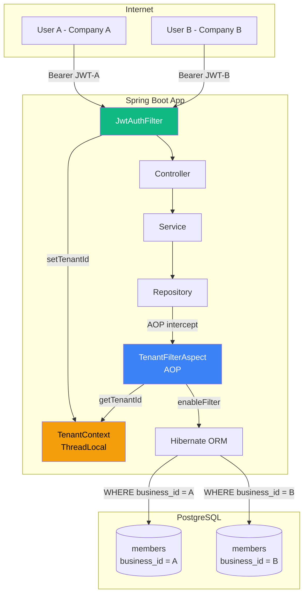
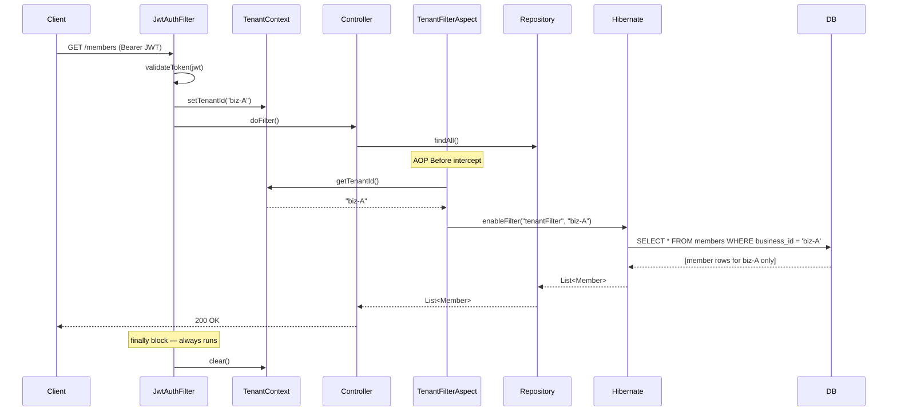
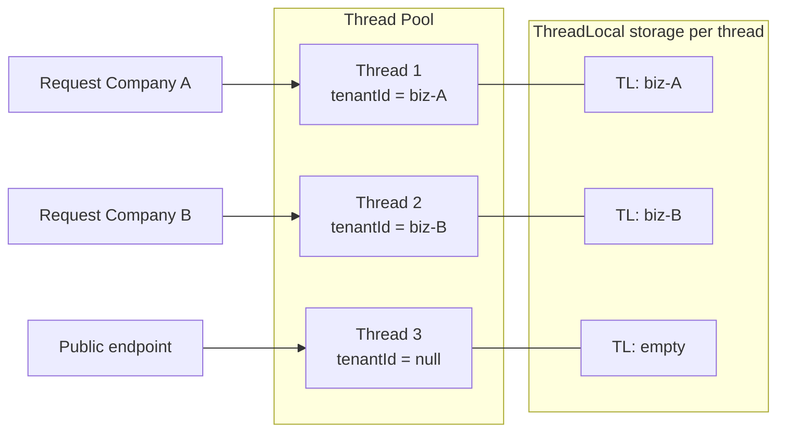
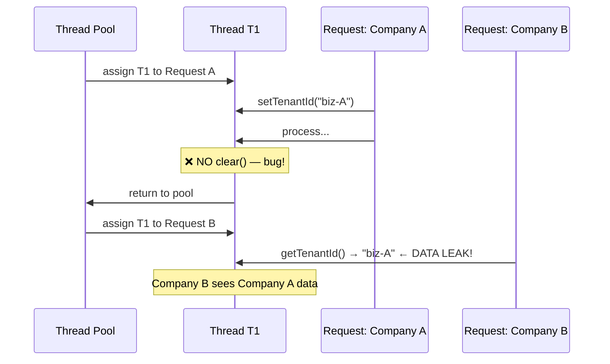
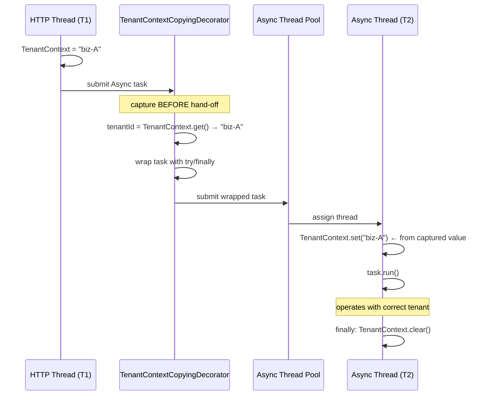
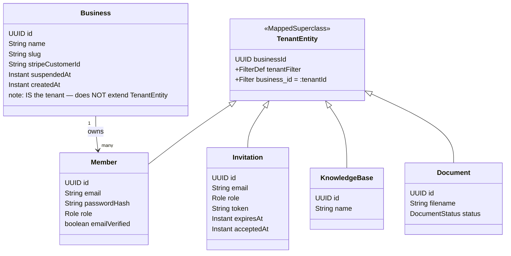
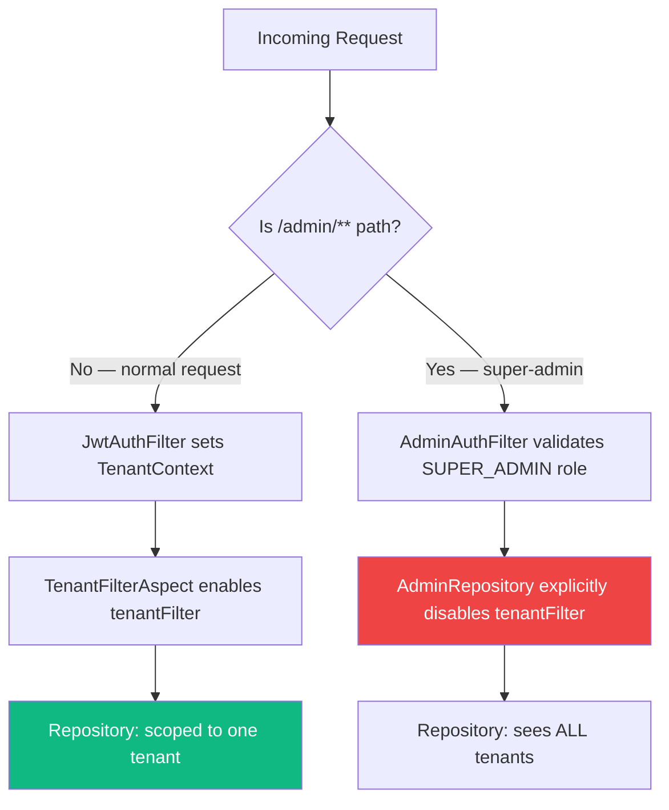
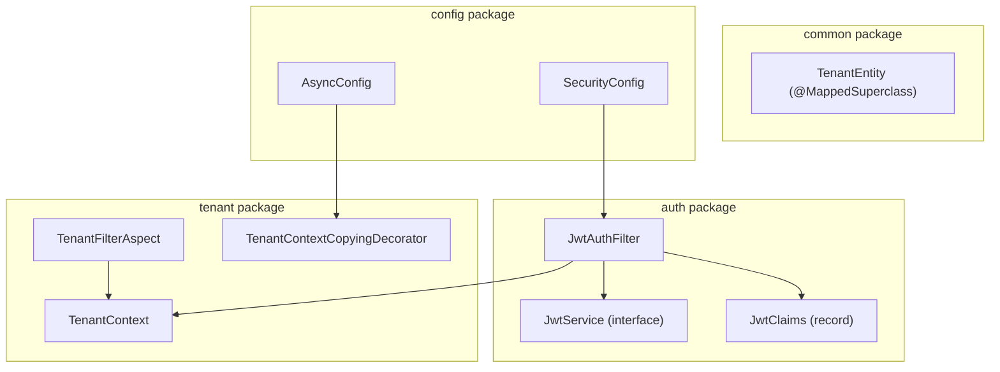

# Multi-Tenancy Architecture

> **Scope:** Row-level tenant isolation — TenantContext, Hibernate Filter, Async propagation  
> **Status:** Implemented in Milestone 1 (PR #13)  
> **Related issue:** [#3 Multi-tenancy Infrastructure](https://github.com/leonard-garden/spring-saas-support-ai/issues/3)

---

## 1. Strategy: Row-level Isolation

Three common SaaS multi-tenancy models:

| Model | Isolation | Cost | Complexity |
|-------|-----------|------|------------|
| DB per tenant | Strongest | Very high | High |
| Schema per tenant | Strong | High | Medium |
| **Row-level (chosen)** | **Good** | **Low** | **Low** |

**Decision:** Shared DB + shared schema. Every business table has a `business_id` column.
Hibernate automatically appends `WHERE business_id = ?` — developers never write this condition manually.

**Why not schema/DB per tenant:** Cost is prohibitive at MVP scale. Row-level is the industry standard for early-stage SaaS (Notion, Linear, etc. all started here).

---

## 2. High-Level Architecture



---

## 3. Request Lifecycle



---

## 4. ThreadLocal Scoping

`TenantContext` works identically to Spring's `RequestContextHolder` — both use `ThreadLocal` to scope data to the current HTTP thread.



**Why `clear()` in `finally` is mandatory:**



---

## 5. Async Thread Propagation

`@Async` runs on a **different thread** with an empty `ThreadLocal`. The `TenantContextCopyingDecorator` bridges this gap.



**Rule:** Always use `@Async("taskExecutor")` — bare `@Async` uses Spring's default executor which has no decorator.

```java
// CORRECT
@Async("taskExecutor")
public CompletableFuture<Void> processDocument(UUID docId) { ... }

// WRONG — default executor, no tenant propagation
@Async
public CompletableFuture<Void> processDocument(UUID docId) { ... }
```

---

## 6. Entity Hierarchy



---

## 7. Admin Bypass Pattern

Super-admin endpoints need cross-tenant visibility. Only `Admin*` prefixed repositories are allowed to disable the filter.



```java
// ONLY in Admin* repositories — anywhere else is a security violation
Session session = em.unwrap(Session.class);
session.disableFilter("tenantFilter");
```

---

## 8. Component Map



---

## 9. Critical Rules

> Violations must be rejected in PR review — no exceptions.

| # | Rule | Consequence if broken |
|---|------|-----------------------|
| 1 | Every business entity MUST extend `TenantEntity` | Data from all tenants visible |
| 2 | `TenantContext.clear()` MUST be in `finally` | Tenant leak between requests |
| 3 | `@Async` MUST use `@Async("taskExecutor")` | Async tasks run without tenant |
| 4 | `disableFilter` ONLY in `Admin*` classes | Cross-tenant data exposure |
| 5 | `spring.threads.virtual.enabled=false` | ThreadLocal breaks with virtual threads |
| 6 | Service MUST call `TenantContext.getTenantId()` when **creating** entities | `business_id` saved as null → constraint fail or orphaned data |

## 10. TenantContext Usage in Service Layer

Hibernate filter handles **reads** automatically — service layer does not need `tenantId` for queries.

**Writes require explicit set:**

```java
// READ — no tenantId needed, filter applies automatically
public List<Member> listMembers() {
    return memberRepository.findAll(); // Hibernate adds: WHERE business_id = ?
}

// WRITE — must set businessId on new entity
public Member createMember(CreateMemberRequest req) {
    UUID tenantId = TenantContext.getTenantId(); // required
    Member member = new Member();
    member.setBusinessId(tenantId);              // must set before save
    member.setEmail(req.email());
    return memberRepository.save(member);
}
```

**Other cases that need `TenantContext.getTenantId()` in service:**

| Case | Reason |
|------|--------|
| Create any entity | Set `business_id` before `repository.save()` |
| Quota enforcement | `COUNT(*) WHERE business_id = ?` for plan limits |
| Audit logging | Record `tenantId` in audit entry |
| Cross-entity validation | Verify invitation token belongs to current tenant |
