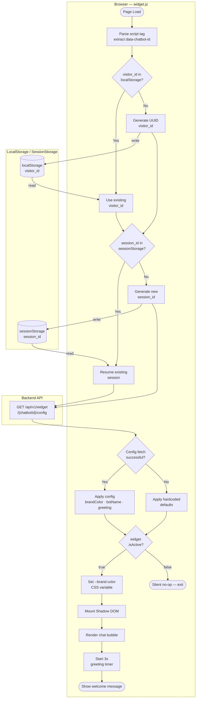

# Activity Diagram — Widget Initialization & Config Load

## Overview
Shows the widget.js bootstrap sequence from page load to the first greeting message, covering visitor/session identity resolution, config fetch, and all fallback paths.

## Diagram

## Key Notes
- `visitor_id` persists across browser sessions (localStorage); `session_id` resets on tab close (sessionStorage).
- Config fetch failure (4xx, 5xx, network timeout) falls back to hardcoded defaults so the widget still renders — `isActive` defaults to `true` in this path.
- The `widget.isActive = false` path produces a silent no-op: no DOM mutation, no console output — invisible to the host page.
- Shadow DOM mount isolates widget CSS from the host page's stylesheet; `--brand-color` is the only variable injected into the host document.
- The 3s greeting timer fires only after the bubble is mounted; it is cancelled if the visitor opens the chat before it fires.
- Public endpoint `/api/v1/widget/{chatbotId}/config` is unauthenticated and rate-limited — `chatbotId` must be a valid UUID, not guessable by enumeration.
