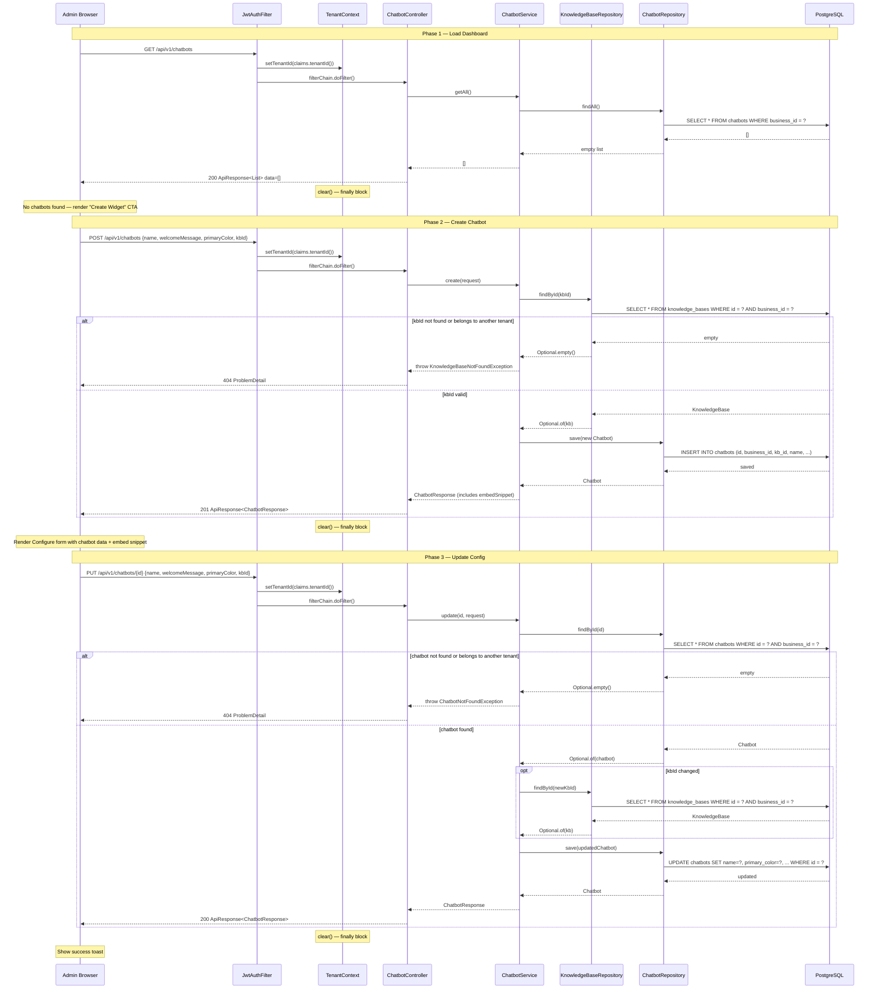

# Sequence Diagram — Admin Widget Configuration Flow

## Overview
Shows the full admin flow for creating and updating a chatbot config from the dashboard: JWT auth setup, initial load, chatbot creation with KB validation, and config update with optional KB reassignment.

## Diagram

## Key Notes
- `JwtAuthFilter` sets `TenantContext` from the JWT `tenant_id` claim before every request; `clear()` runs unconditionally in the `finally` block.
- `ChatbotRepository.findById()` goes through `TenantFilterAspect` — the Hibernate filter auto-appends `WHERE business_id = ?`, so cross-tenant access is impossible without explicitly disabling the filter (Admin\* repos only).
- KB validation in Phase 2 and Phase 3 uses the same tenant-filtered `KnowledgeBaseRepository` — a MEMBER cannot reference another tenant's KB even if they know the UUID.
- The `embedSnippet` returned in Phase 2 is a pre-built `<script>` tag the admin can paste directly into any website; no further API calls needed to go live.
- Phase 3 `kbId` update is optional — only validated when present in the request body (partial update pattern via `PUT`).
