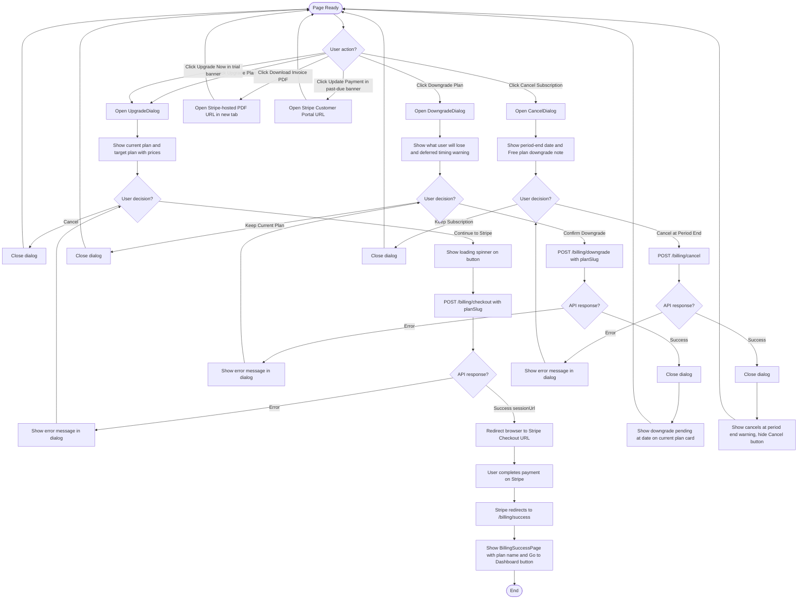

# Activity Diagram — Billing Web UI

## Overview
Shows the conditional rendering decisions on `/billing` page load and all user-initiated action flows (upgrade, downgrade, cancel, invoice download), including dialog interactions and backend API calls.

---

## Page Load Activity

```mermaid
flowchart TD
    Start([Start]) --> RouteGuard{User role is OWNER?}

    RouteGuard -- No --> RedirectDashboard[Redirect to /dashboard]
    RedirectDashboard --> End1([End])

    RouteGuard -- Yes --> FetchData[Fetch subscription, usage, plans, invoices]
    FetchData --> SkeletonLoading[Show skeleton loaders]
    SkeletonLoading --> DataReady{Data loaded?}

    DataReady -- Error --> ShowError[Show error state with retry]
    ShowError --> End2([End])

    DataReady -- Yes --> CheckStatus{subscription.status?}

    CheckStatus -- TRIALING --> ShowTrialBanner[Show trial banner with days countdown]
    ShowTrialBanner --> CheckPastDue

    CheckStatus -- PAST_DUE --> CheckPastDue{status is PAST_DUE?}
    CheckPastDue -- Yes --> ShowPastDueBanner[Show payment failed banner]
    ShowPastDueBanner --> RenderPlanCard

    CheckStatus -- ACTIVE --> RenderPlanCard
    CheckStatus -- CANCELED --> RenderPlanCard
    CheckPastDue -- No --> RenderPlanCard

    RenderPlanCard{cancelAtPeriodEnd is true?}
    RenderPlanCard -- Yes --> HideCancelButton[Hide Cancel button]
    HideCancelButton --> ShowCancelWarning[Show cancels at period end warning]
    ShowCancelWarning --> CheckPendingPlan

    RenderPlanCard -- No --> ShowCancelButton[Show Cancel Subscription button]
    ShowCancelButton --> CheckPendingPlan

    CheckPendingPlan{pendingPlanId set?}
    CheckPendingPlan -- Yes --> ShowDowngradePending[Show downgrade pending at date on plan card]
    ShowDowngradePending --> RenderUsage

    CheckPendingPlan -- No --> RenderUsage

    RenderUsage[Render usage meters for KBs, Documents, Messages, Members]
    RenderUsage --> CheckPlanBusiness{current plan is Business?}

    CheckPlanBusiness -- Yes --> ShowUnlimited[Show Unlimited text, no progress bars]
    ShowUnlimited --> RenderPlansGrid

    CheckPlanBusiness -- No --> CheckUsageCritical{any metric usage >= 95%?}
    CheckUsageCritical -- Yes --> ShowRedBar[Show red progress bar and red number]
    ShowRedBar --> CheckUsageWarning

    CheckUsageCritical -- No --> CheckUsageWarning{any metric usage >= 80%?}
    CheckUsageWarning -- Yes --> ShowAmberBar[Show amber progress bar and amber number]
    ShowAmberBar --> RenderPlansGrid

    CheckUsageWarning -- No --> ShowGreenBar[Show green progress bar]
    ShowGreenBar --> RenderPlansGrid

    RenderPlansGrid[Render 4 plan cards: Free, Starter, Pro, Business]
    RenderPlansGrid --> RenderInvoices[Render payment history table]
    RenderInvoices --> PageReady([Page Ready])
```

---

## User Action Flows

---

## Key Notes

- **OWNER guard** is the first decision — Members are redirected to `/dashboard` before any data is fetched.
- **Trial and past-due banners** are evaluated independently; both could show simultaneously if the subscription status changed mid-cycle, but in practice only one applies per status value.
- **Upgrade is immediate** — POST /billing/checkout returns a Stripe `sessionUrl`; the backend activates the new plan via `checkout.session.completed` webhook after payment.
- **Downgrade is deferred** — only `pendingPlanId` is set; the actual plan change happens at the next billing cycle renewal via webhook.
- **Cancel is at period end** — `cancelAtPeriodEnd=true` is set immediately; access continues until `currentPeriodEnd`. The Cancel button is hidden optimistically after confirmation without a full page reload.
- **Usage color thresholds** apply per metric independently: a page can show green, amber, and red bars simultaneously across different metrics.
- **Business plan** skips all progress bar rendering entirely — limit of `-1` maps to "Unlimited" text with no bar.
- **Dialogs do not call APIs until the user confirms** — opening a dialog is a pure client-side state change with no network cost.
