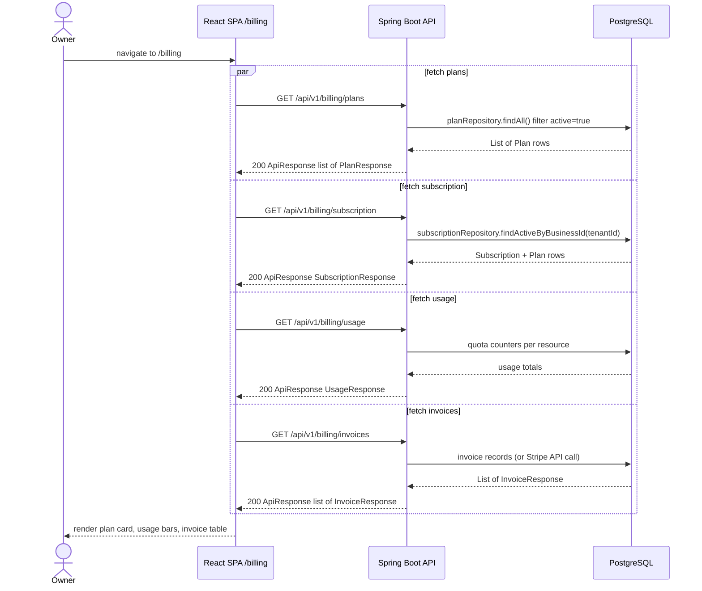
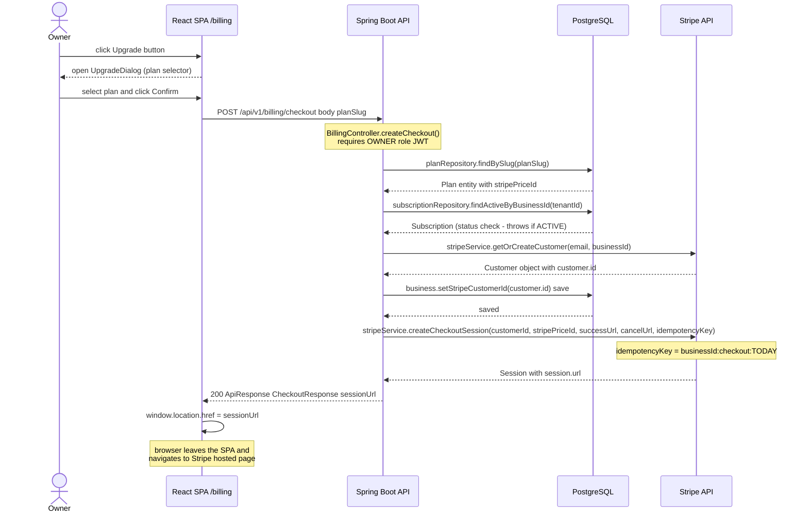
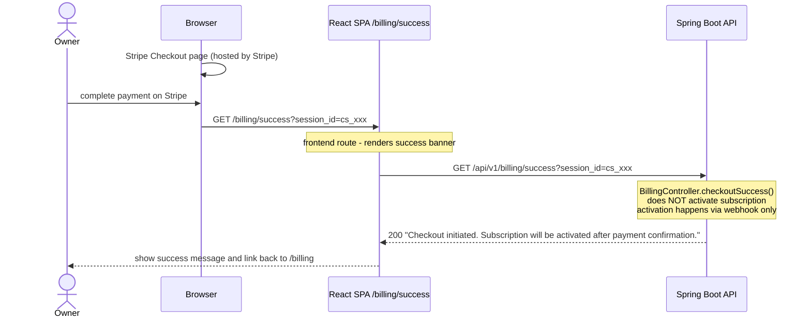
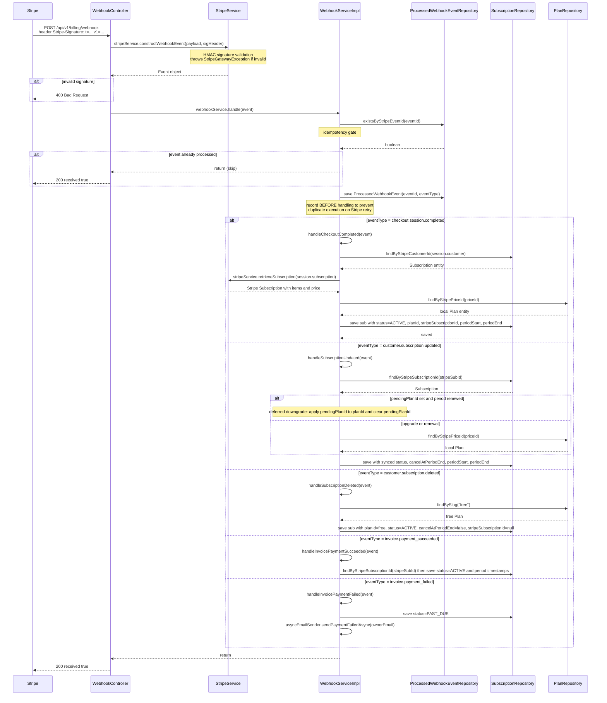
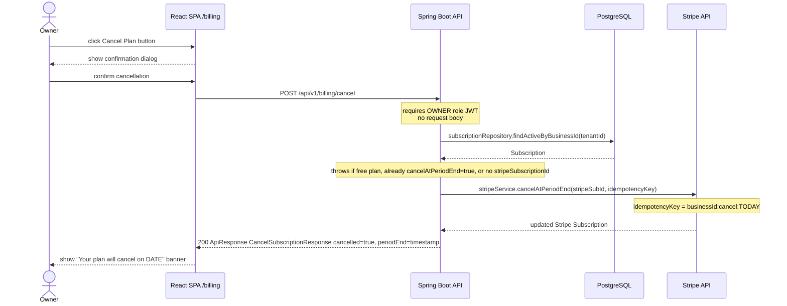
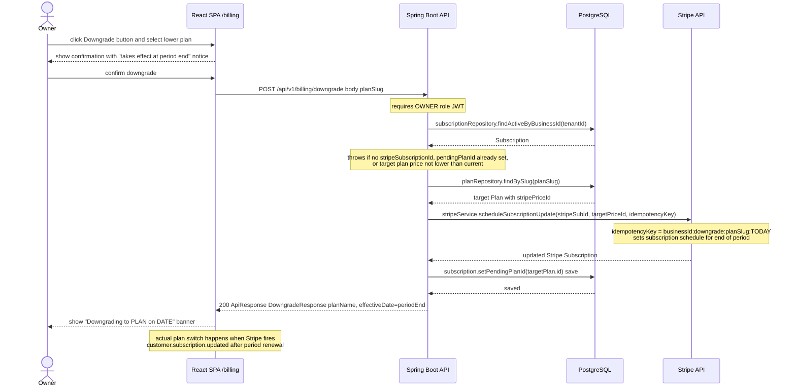
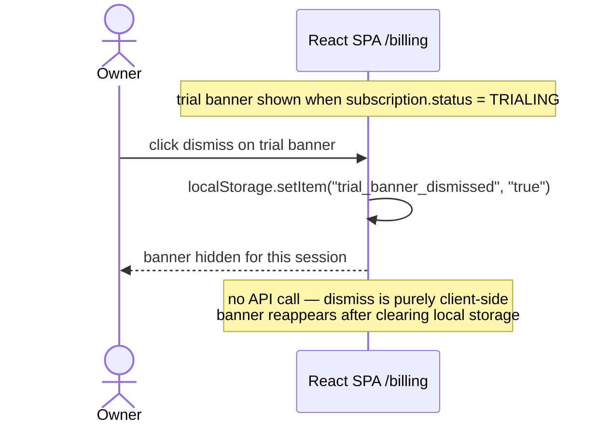

# Sequence Diagram — Billing Web UI

## Overview

These diagrams cover the full async billing lifecycle: page load, the Stripe Checkout upgrade flow
(including webhook processing), and the supporting flows for cancel, downgrade, and trial banner dismiss.

---

## Page Load Sequence

All four API calls are fired in parallel when the owner navigates to `/billing`.
`GET /billing/usage` and `GET /billing/invoices` are planned endpoints (M4 backend SRS).

---

## Upgrade Flow (Stripe Checkout)

### Step 1 — Owner initiates checkout

### Step 2 — Owner pays on Stripe and lands on success page

---

## Webhook Processing

Stripe fires this asynchronously after payment. No JWT — Stripe calls the backend directly.

---

## Cancel Flow

---

## Downgrade Flow

---

## Trial Banner Dismiss

---

## Key Notes

- `GET /billing/success` is an **acknowledgement only** — it does not activate the subscription. Activation is driven exclusively by the `checkout.session.completed` webhook.
- The webhook idempotency gate (`ProcessedWebhookEventRepository.existsByStripeEventId`) records the event **before** processing to prevent duplicate execution on Stripe retries.
- `POST /billing/checkout` uses `Propagation.NOT_SUPPORTED` — no outer transaction — because Stripe API calls must not be wrapped in a DB transaction.
- The downgrade is deferred: `pendingPlanId` is set in the DB immediately, but the plan switch is applied by `handleSubscriptionUpdated` only when the billing period renews (`newPeriodStart.isAfter(currentPeriodStart)`).
- `POST /billing/upgrade` calls `stripeService.updateSubscription` with immediate proration; the DB `planId` is synced by the resulting `customer.subscription.updated` webhook, not by the HTTP response.
- All billing endpoints (except `/webhook`) require a valid JWT with `OWNER` role. The webhook endpoint has no JWT — it is authenticated by Stripe HMAC signature only.
