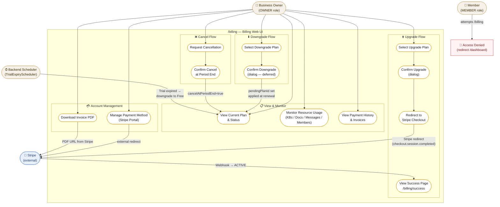

# Use Case Diagram — Billing Web UI

## Overview
Shows all actors (Business Owner, Member, Stripe, Backend Scheduler) and their interactions with the Billing Web UI use cases. Highlights which flows are immediate vs. deferred, and which involve Stripe redirect.

## Diagram

## Key Notes

- **OWNER only** — Member role is blocked at the route level (`ProtectedRoute` role check); all billing API endpoints return 403 for non-OWNER JWTs.
- **Upgrade is immediate** — POST /billing/checkout → Stripe Checkout → webhook `checkout.session.completed` → status=ACTIVE. No deferred logic.
- **Downgrade is deferred** — `pendingPlanId` set in DB; applied only when `customer.subscription.updated` fires with a new billing period start. Owner sees "pending" indicator on plan card.
- **Cancel is at period end** — access continues until `currentPeriodEnd`; account auto-downgrades to Free via `customer.subscription.deleted` webhook.
- **Scheduler side-effect** — `TrialExpiryScheduler` runs at 02:00 daily; when trial expires, subscription downgrades to Free silently. Owner sees the status change on next `/billing` load.
- **Stripe Portal** (Manage Payment Method) and **Invoice PDF** links are external redirects — no backend proxy, Stripe URLs opened directly.
- **`GET /billing/usage`** and **`GET /billing/invoices`** are new backend endpoints required before UC2 and UC3 can show real data (currently mock data in prototype).
