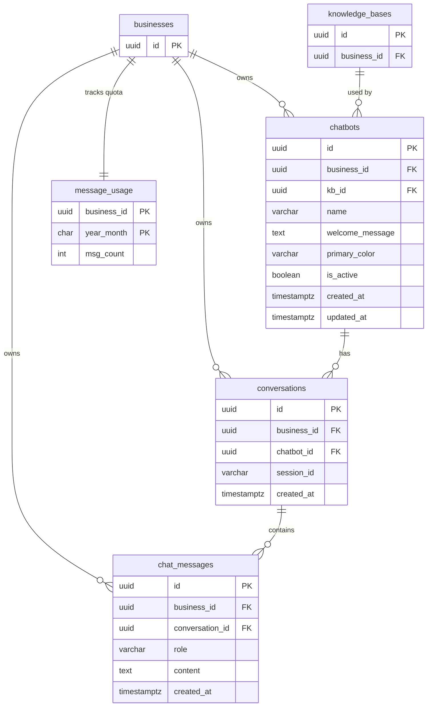

# DB Schema — M3: AI Chat + Embeddable Widget

**Version:** 1.0
**Date:** 2026-05-29
**Flyway migrations:** V16–V19

---

## ERD



---

## Table Definitions

### chatbots

| Column | Type | Nullable | Default | Description |
|--------|------|----------|---------|-------------|
| id | UUID | NOT NULL | gen_random_uuid() | Primary key |
| business_id | UUID | NOT NULL | — | Tenant FK → businesses(id) |
| kb_id | UUID | NOT NULL | — | FK → knowledge_bases(id); the KB used for RAG |
| name | VARCHAR(100) | NOT NULL | — | Display name shown in widget header |
| welcome_message | VARCHAR(500) | NOT NULL | — | First message shown to end users |
| primary_color | VARCHAR(7) | NOT NULL | '#3B82F6' | Hex color code e.g. #3B82F6 |
| is_active | BOOLEAN | NOT NULL | true | If false, widget endpoint returns 404 |
| created_at | TIMESTAMPTZ | NOT NULL | now() | |
| updated_at | TIMESTAMPTZ | NOT NULL | now() | |

### conversations

| Column | Type | Nullable | Default | Description |
|--------|------|----------|---------|-------------|
| id | UUID | NOT NULL | gen_random_uuid() | Primary key |
| business_id | UUID | NOT NULL | — | Tenant FK → businesses(id) |
| chatbot_id | UUID | NOT NULL | — | FK → chatbots(id) |
| session_id | VARCHAR(100) | NULL | — | Widget session UUID from X-Session-Id header; NULL for dashboard chat |
| created_at | TIMESTAMPTZ | NOT NULL | now() | |

### chat_messages

| Column | Type | Nullable | Default | Description |
|--------|------|----------|---------|-------------|
| id | UUID | NOT NULL | gen_random_uuid() | Primary key |
| business_id | UUID | NOT NULL | — | Tenant FK → businesses(id) — denormalized for Hibernate filter |
| conversation_id | UUID | NOT NULL | — | FK → conversations(id) ON DELETE CASCADE |
| role | VARCHAR(20) | NOT NULL | — | USER or ASSISTANT |
| content | TEXT | NOT NULL | — | Full message text |
| created_at | TIMESTAMPTZ | NOT NULL | now() | |

> `business_id` is denormalized into `chat_messages` so the Hibernate `tenantFilter`
> (`WHERE business_id = :tenantId`) works without a join to `conversations`.

### message_usage

| Column | Type | Nullable | Default | Description |
|--------|------|----------|---------|-------------|
| business_id | UUID | NOT NULL | — | Composite PK part 1; FK → businesses(id) |
| year_month | CHAR(7) | NOT NULL | — | Composite PK part 2; format: `2026-05` |
| msg_count | INT | NOT NULL | 0 | Atomically incremented counter |

> This table does NOT extend `TenantEntity` — it uses a composite PK keyed by `business_id`
> directly. The JPA entity uses `@IdClass` or `@EmbeddedId`. No Hibernate filter needed:
> all queries explicitly filter by `business_id`.

---

## Flyway Migrations

### V16 — chatbots

**File:** `src/main/resources/db/migration/V16__create_chatbots.sql`

```sql
CREATE TABLE chatbots (
    id              UUID        PRIMARY KEY DEFAULT gen_random_uuid(),
    business_id     UUID        NOT NULL REFERENCES businesses(id) ON DELETE CASCADE,
    kb_id           UUID        NOT NULL REFERENCES knowledge_bases(id) ON DELETE RESTRICT,
    name            VARCHAR(100) NOT NULL,
    welcome_message VARCHAR(500) NOT NULL,
    primary_color   VARCHAR(7)  NOT NULL DEFAULT '#3B82F6',
    is_active       BOOLEAN     NOT NULL DEFAULT true,
    created_at      TIMESTAMPTZ NOT NULL DEFAULT now(),
    updated_at      TIMESTAMPTZ NOT NULL DEFAULT now()
);

CREATE INDEX idx_chatbots_business_id ON chatbots(business_id);
CREATE INDEX idx_chatbots_kb_id ON chatbots(kb_id);
```

> `kb_id` uses `ON DELETE RESTRICT` — deleting a KB that has active chatbots must be blocked
> at the DB level. Callers should deactivate or reassign chatbots first.

---

### V17 — conversations

**File:** `src/main/resources/db/migration/V17__create_conversations.sql`

```sql
CREATE TABLE conversations (
    id          UUID        PRIMARY KEY DEFAULT gen_random_uuid(),
    business_id UUID        NOT NULL REFERENCES businesses(id) ON DELETE CASCADE,
    chatbot_id  UUID        NOT NULL REFERENCES chatbots(id) ON DELETE CASCADE,
    session_id  VARCHAR(100),
    created_at  TIMESTAMPTZ NOT NULL DEFAULT now()
);

CREATE INDEX idx_conversations_business_id ON conversations(business_id);
CREATE INDEX idx_conversations_chatbot_id ON conversations(chatbot_id);
-- Widget needs to look up existing conversation by session_id quickly
CREATE INDEX idx_conversations_session_id ON conversations(session_id) WHERE session_id IS NOT NULL;
```

---

### V18 — chat_messages

**File:** `src/main/resources/db/migration/V18__create_chat_messages.sql`

```sql
CREATE TABLE chat_messages (
    id              UUID        PRIMARY KEY DEFAULT gen_random_uuid(),
    business_id     UUID        NOT NULL REFERENCES businesses(id) ON DELETE CASCADE,
    conversation_id UUID        NOT NULL REFERENCES conversations(id) ON DELETE CASCADE,
    role            VARCHAR(20) NOT NULL CHECK (role IN ('USER', 'ASSISTANT')),
    content         TEXT        NOT NULL,
    created_at      TIMESTAMPTZ NOT NULL DEFAULT now()
);

CREATE INDEX idx_chat_messages_business_id ON chat_messages(business_id);
CREATE INDEX idx_chat_messages_conversation_id ON chat_messages(conversation_id);
```

---

### V19 — message_usage

**File:** `src/main/resources/db/migration/V19__create_message_usage.sql`

```sql
CREATE TABLE message_usage (
    business_id UUID   NOT NULL REFERENCES businesses(id) ON DELETE CASCADE,
    year_month  CHAR(7) NOT NULL,    -- e.g. '2026-05'
    msg_count   INT    NOT NULL DEFAULT 0,
    PRIMARY KEY (business_id, year_month)
);
```

> **Quota increment pattern (atomic upsert):**
> ```sql
> INSERT INTO message_usage (business_id, year_month, msg_count)
> VALUES (:businessId, :yearMonth, 1)
> ON CONFLICT (business_id, year_month)
> DO UPDATE SET msg_count = message_usage.msg_count + 1;
> ```
> Use `@Modifying @Query(nativeQuery = true)` on a `JpaRepository` method —
> no `JdbcTemplate`, no raw JDBC.

---

## Entity Skeletons (Java)

### Chatbot.java

```java
@Entity
@Table(name = "chatbots")
public class Chatbot extends TenantEntity {

    @Id
    @GeneratedValue(strategy = GenerationType.UUID)
    private UUID id;

    @Column(name = "kb_id", nullable = false)
    private UUID kbId;

    @Column(name = "name", nullable = false, length = 100)
    private String name;

    @Column(name = "welcome_message", nullable = false, length = 500)
    private String welcomeMessage;

    @Column(name = "primary_color", nullable = false, length = 7)
    private String primaryColor = "#3B82F6";

    @Column(name = "is_active", nullable = false)
    private boolean isActive = true;

    @Column(name = "created_at", nullable = false, updatable = false)
    private Instant createdAt = Instant.now();

    @Column(name = "updated_at", nullable = false)
    private Instant updatedAt = Instant.now();

    @Override
    public void setBusinessId(UUID businessId) {
        super.setBusinessId(businessId);
    }

    // getters and setters
}
```

### Conversation.java

```java
@Entity
@Table(name = "conversations")
public class Conversation extends TenantEntity {

    @Id
    @GeneratedValue(strategy = GenerationType.UUID)
    private UUID id;

    @Column(name = "chatbot_id", nullable = false)
    private UUID chatbotId;

    @Column(name = "session_id", length = 100)
    private String sessionId;

    @Column(name = "created_at", nullable = false, updatable = false)
    private Instant createdAt = Instant.now();

    @Override
    public void setBusinessId(UUID businessId) {
        super.setBusinessId(businessId);
    }

    // getters and setters
}
```

### ChatMessage.java

```java
@Entity
@Table(name = "chat_messages")
public class ChatMessage extends TenantEntity {

    @Id
    @GeneratedValue(strategy = GenerationType.UUID)
    private UUID id;

    @Column(name = "conversation_id", nullable = false)
    private UUID conversationId;

    @Enumerated(EnumType.STRING)
    @Column(name = "role", nullable = false, length = 20)
    private MessageRole role;

    @Column(name = "content", nullable = false, columnDefinition = "TEXT")
    private String content;

    @Column(name = "created_at", nullable = false, updatable = false)
    private Instant createdAt = Instant.now();

    @Override
    public void setBusinessId(UUID businessId) {
        super.setBusinessId(businessId);
    }

    // getters and setters

    public enum MessageRole {
        USER, ASSISTANT
    }
}
```

### MessageUsage.java

```java
@Entity
@Table(name = "message_usage")
public class MessageUsage {

    @EmbeddedId
    private MessageUsageId id;

    @Column(name = "msg_count", nullable = false)
    private int msgCount = 0;

    // getters and setters

    @Embeddable
    public record MessageUsageId(
        @Column(name = "business_id") UUID businessId,
        @Column(name = "year_month") String yearMonth
    ) implements java.io.Serializable {}
}
```

> `MessageUsage` does NOT extend `TenantEntity` — it is not a business data entity and
> does not need the Hibernate tenant filter. All repository queries explicitly filter
> by `businessId` in the method signature.

---

## Index Strategy

| Index | Table | Columns | Reason |
|-------|-------|---------|--------|
| idx_chatbots_business_id | chatbots | business_id | Tenant filter on every query |
| idx_chatbots_kb_id | chatbots | kb_id | FK lookup when validating/deleting KB |
| idx_conversations_business_id | conversations | business_id | Tenant filter |
| idx_conversations_chatbot_id | conversations | chatbot_id | List conversations by chatbot |
| idx_conversations_session_id | conversations | session_id (partial: NOT NULL) | Widget session lookup |
| idx_chat_messages_business_id | chat_messages | business_id | Tenant filter |
| idx_chat_messages_conversation_id | chat_messages | conversation_id | Load message history |

---

## Migration Notes

- Run `mvn flyway:info` before applying to verify sequence starts at V16
- Apply in order: V16 → V17 → V18 → V19 (V17 FKs chatbots, V18 FKs conversations)
- `V16`: `kb_id ON DELETE RESTRICT` is intentional — chatbot must be deleted before KB
- `V18`: `CHECK (role IN ('USER', 'ASSISTANT'))` is enforced at DB level as a safety net; JPA enum is the primary guard
- `V19`: No `updated_at` — the counter is only ever incremented, never set to an arbitrary value
- Test migration locally: `docker-compose up -d && mvn flyway:migrate`
