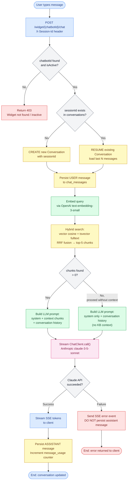

# Activity Diagram — RAG Chat Flow

## Overview
Decision points, parallel activities, and error paths for the RAG chat flow. Covers both the public widget path (no JWT) and the authenticated dashboard path. Four swimlanes: Widget JS, Backend (ChatService), Database, and Claude API.

## Diagram

## Swimlane Legend
| Color | Swimlane |
|-------|---------|
| Blue | Widget JS (Client) |
| Green | Backend — ChatService |
| Yellow | Database — PostgreSQL + PgVector |
| Pink | Claude API (External) |
| Red | Error paths |

## Key Notes
- `SAVE_USER` happens **before** the Claude call — message is persisted even if LLM fails, preserving the conversation audit trail.
- When PgVector returns 0 chunks, the flow does **not** abort — it falls back to a prompt without RAG context. LLM responds with a graceful "I don't have information on that."
- `TenantContext` is set from `chatbotId` DB lookup (not JWT) for the widget path and must be cleared in a `finally` block after the stream closes.
- The ASSISTANT message is only persisted on **successful** Claude stream completion — partial/failed streams are never written to DB.
- `message_usage` counter is incremented atomically via DB upsert after the assistant message is saved.
