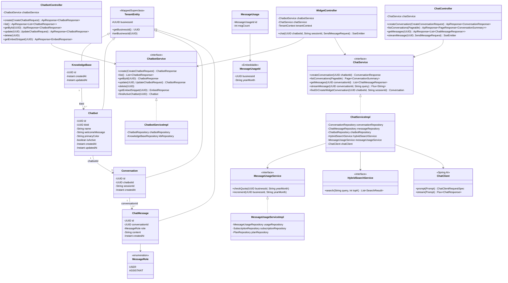

# Class Diagram — M3: AI Chat + Embeddable Widget

## Overview
Entity hierarchy, service interfaces, and controller dependencies for the `chat/` and `chatbot/` packages. Shows how M3 classes relate to existing M2 foundations (`TenantEntity`, `HybridSearchService`, `KnowledgeBase`).

## Diagram

## Key Notes
- `WidgetController` sets `TenantContext` manually from `ChatbotService.findActiveChatbot()` result, then clears it in `finally` — mirrors what `JwtAuthFilter` does for authenticated paths.
- `MessageUsage` does NOT extend `TenantEntity`. Its composite PK `(business_id, year_month)` makes Hibernate tenant filter unnecessary.
- `ChatServiceImpl` depends on `HybridSearchService` (M2) — M3 does not re-implement search.
- `ChatClient` is a Spring AI managed bean configured via `ANTHROPIC_API_KEY` in `application.yml`.
- All repository interfaces follow Spring Data JPA convention and are not shown in this diagram for brevity.
