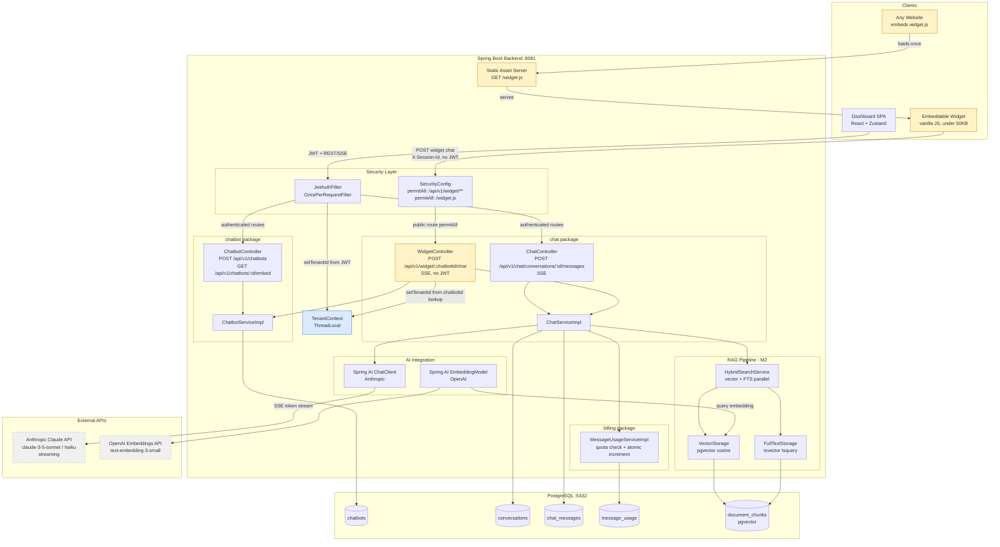

# Component Diagram — M3: AI Chat + Embeddable Widget

## Overview
System-level view of all components involved in M3, including external integrations (Anthropic Claude, OpenAI Embeddings, PostgreSQL/pgvector) and the two distinct client surfaces (dashboard frontend + embedded widget).

## Diagram

## Key Notes
- **Two trust boundaries:** Authenticated clients (Dashboard) go through `JwtAuthFilter`; the public widget path is `permitAll` and resolves tenant from `chatbotId` DB lookup only.
- **SSE streaming:** Both `ChatController` and `WidgetController` return `SseEmitter`. The stream runs on the HTTP thread — no `@Async`. Spring AI `ChatClient.stream()` returns a `Flux<ChatResponse>` that the controller subscribes to and flushes token-by-token.
- **EmbeddingModel** is called at search time (inside `VectorStorage`) to embed the user query — not at message persist time.
- **`TenantContext`** is the shared mutable state between the security layer and the RAG pipeline. Both paths MUST call `TenantContext.clear()` in `finally`.
- **`widget.js`** is a static asset served by Spring Boot — no build pipeline, no React. It reads `data-chatbot-id` from the `<script>` tag and uses the browser `EventSource` API to consume the SSE stream.
