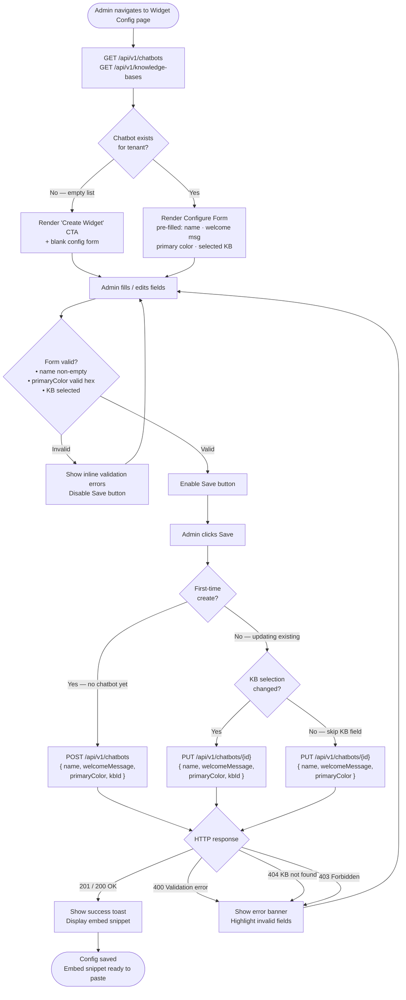

# Activity Diagram — Admin Widget Configuration Flow

## Overview
Models the full admin workflow for configuring the embeddable widget: initial page load branching on whether a chatbot already exists, inline form validation, and the conditional save path (POST vs PUT, with or without KB reassignment).

## Diagram

## Key Notes
- **Load phase** fires two requests in parallel (`/chatbots` + `/knowledge-bases`) so the KB dropdown is populated before the form renders.
- **Branching on exists:** an empty chatbot list shows the Create CTA; any existing chatbot goes straight to the pre-filled Configure form. Only one chatbot per tenant is assumed for M3.
- **Client-side validation** runs on every field change (controlled form); the Save button stays disabled until all rules pass — preventing a round-trip on obviously bad input.
- **KB-changed guard** avoids an unnecessary `kbId` field in the PUT body when the admin only updates cosmetic fields (name/color/welcome message).
- **Error banner → re-edit loop**: backend validation errors (400/404) surface inline and return the user to the form rather than clearing their input.
- **Swimlane mapping** (implicit): `FETCH` / `POST` / `PUT` calls originate in **React Dashboard**; routing and response handling happen in **ChatbotController + ChatbotService**; `EXISTS` / `KB_CHANGED` decisions reflect state held in **React Dashboard** component state after the initial GET.
