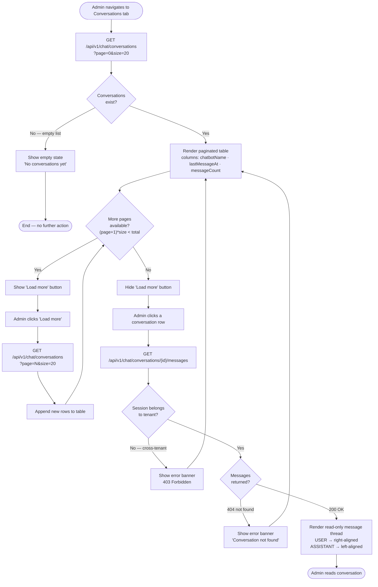

# Activity Diagram — Chat History View Flow

## Overview
Models the admin workflow for browsing and reading past chat conversations: paginated sessions list with empty-state handling, "Load more" pagination guard, and drill-down into a message thread with tenant-ownership validation.

## Diagram

## Key Notes
- **Empty state branch** exits early — no table, no pagination, no row selection possible until a conversation exists (created via widget interaction).
- **Pagination guard** re-evaluates after every "Load more" response using `(page + 1) * size < total`; the button is hidden once the last page is reached.
- **Tenant-ownership guard** is enforced server-side via the Hibernate tenant filter on `ConversationRepository.findById()` — the 403/404 branch in the diagram reflects what React renders when the API returns an error, not a client-side check.
- **No write path** — this entire flow is read-only; no mutations, no `@Async` boundary.
- **Swimlane mapping** (implicit): `FETCH*` calls originate in **React Dashboard**; routing and DB queries happen in **WidgetAdminController / ConversationService / ConversationRepository**; `HAS_DATA` / `MORE` / `OWNS` decisions reflect **React Dashboard** component state after each API response.
