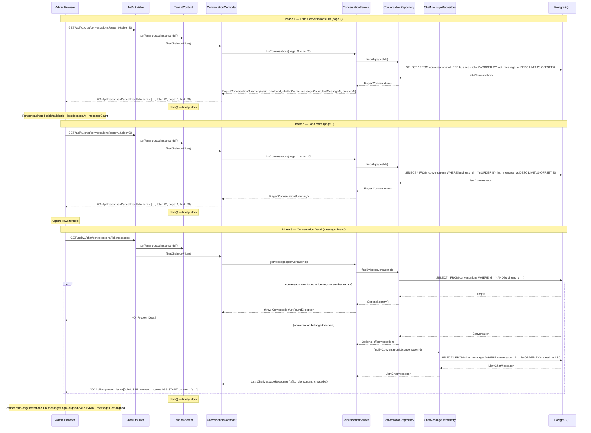

# Sequence Diagram — Chat History View Flow

## Overview
Shows the admin flow for browsing past conversations from the dashboard: JWT auth + tenant setup, paginated sessions list, "Load more" pagination, and drill-down into a conversation's full message thread with tenant-ownership guard.

## Diagram

## Key Notes
- `TenantFilterAspect` enables the Hibernate filter before every `ConversationRepository` call, so `findAll()` in Phase 1–2 automatically scopes to the current tenant's `business_id` — no explicit `WHERE` needed in service code.
- Phase 3 does a two-step guard: `findById` goes through the tenant filter (returns empty if cross-tenant), then `ConversationNotFoundException` is thrown before any message query runs — message data is never exposed even partially.
- `clear()` runs in the `JwtAuthFilter` `finally` block unconditionally — tenant context never leaks to the next request on the same thread.
- Pagination uses zero-based page index; `total: 42` lets React compute whether "Load more" should still be shown (`(page + 1) * size < total`).
- Message ordering is `created_at ASC` (chronological) — matches the read-only thread rendering where oldest messages appear at the top.
- No `@Async` boundary in this flow — both list and detail reads are synchronous, inline on the HTTP thread.
