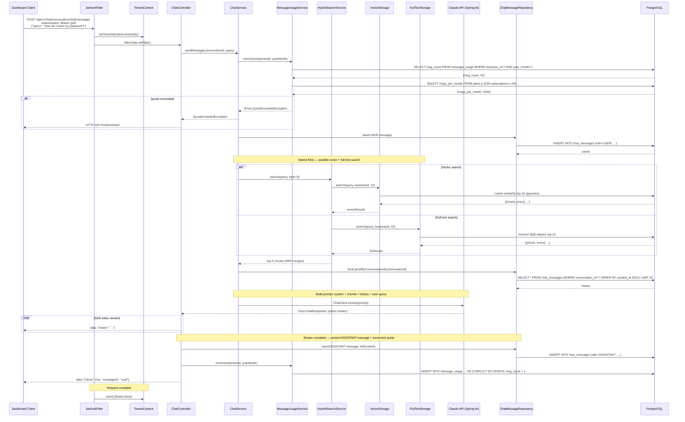
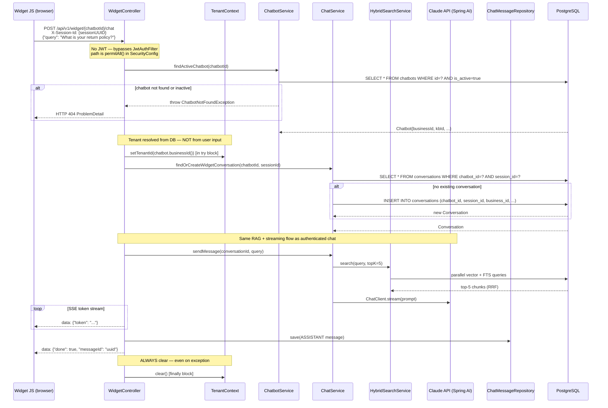

# Sequence Diagram — M3: AI Chat + Embeddable Widget

## Overview
Two flows: (1) authenticated dashboard chat with SSE streaming through the RAG pipeline; (2) public widget chat where tenant is resolved from `chatbotId` instead of JWT.

## Diagram

### Flow 1 — Authenticated Dashboard Chat (SSE)

---

### Flow 2 — Public Widget Chat (no JWT)

## Key Notes
- `TenantContext.setTenantId()` is called from two different places: `JwtAuthFilter` (authenticated) and `WidgetController` (public). Both MUST clear in `finally`.
- SSE streaming runs on the HTTP thread — NOT `@Async`. Spring AI `ChatClient.stream()` returns a `Flux<ChatResponse>` that Spring MVC flushes as SSE events.
- `HybridSearchService.search()` internally uses `CompletableFuture` with `taskExecutor` to run vector and FTS in parallel, then merges with RRF.
- ASSISTANT message and quota increment happen AFTER the stream completes. If LLM call fails mid-stream, an `event: error` SSE is sent and nothing is persisted.
- Widget `session_id` links multiple requests to the same `Conversation`. New `sessionId` = new conversation.
