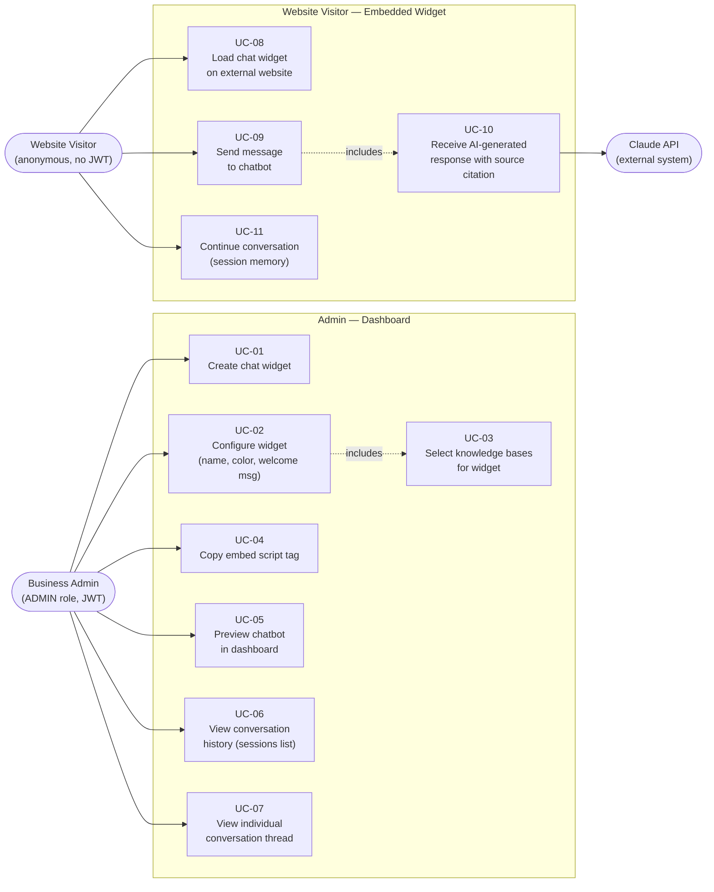

# Use Case Diagram — M3: AI Chat + Embeddable Widget

## Overview
All M3 actors and their interactions with the Chat Widget System. Covers the Business Admin managing chatbot configuration, the Website Visitor using the embedded widget, and the Claude API as an external AI actor.

## Diagram

## Key Notes
- `UC-02 «includes» UC-03` — KB selection is mandatory during widget configuration; cannot configure without choosing at least one KB.
- `UC-09 «includes» UC-10` — every message send triggers the full RAG pipeline (hybrid search → RRF → Claude API call); they cannot be decoupled.
- `UC-08` (widget load) is a prerequisite for UC-09/UC-10/UC-11 but is not modelled as `«includes»` — it is a separate actor-initiated action (page load event, not a business use case choice).
- Website Visitor has no JWT — tenant context is resolved from `chatbotId` embedded in the widget script tag (`data-chatbot-id`).
- Claude API appears as a system actor, not a human actor — it is invoked by UC-10 and never interacts directly with actors.
