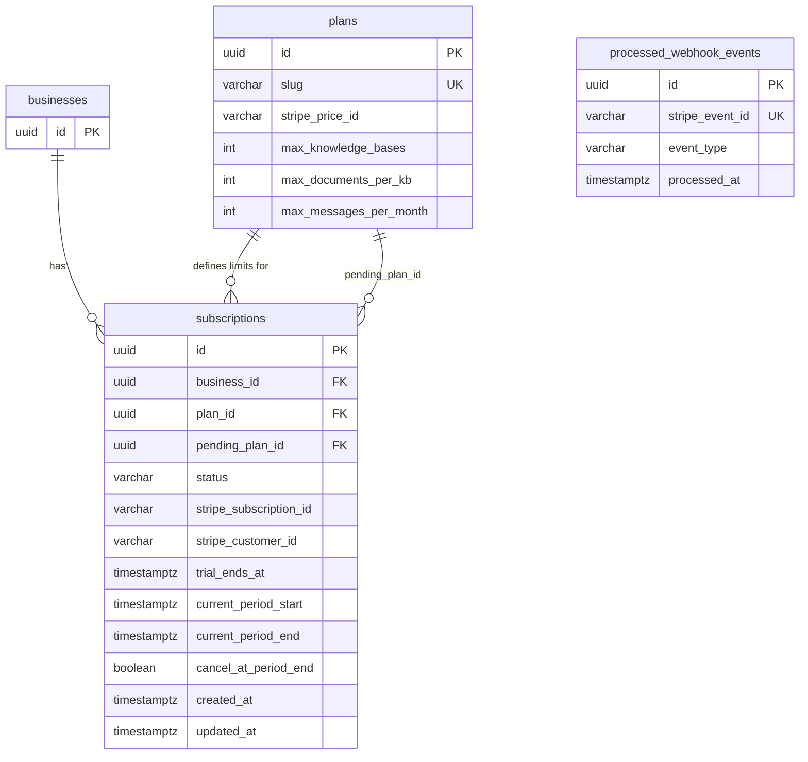

# DB Schema — M4 Billing

**Version:** 1.0
**Date:** 2026-06-02

---

## Summary of Changes

M4 introduces two migrations on top of the existing schema:

| Migration | Type | Description |
|-----------|------|-------------|
| `V21__create_processed_webhook_events.sql` | New table | Webhook idempotency store |
| `V22__alter_subscriptions_m4.sql` | ALTER | Add `stripe_customer_id`, `pending_plan_id`, `cancel_at_period_end`, `updated_at`; fix `TIMESTAMP` → `TIMESTAMPTZ` |

---

## Existing Schema (relevant tables)

### `plans` (V3, seeded in V8)

| Column | Type | Notes |
|--------|------|-------|
| id | UUID PK | |
| name | VARCHAR | e.g. "Pro" |
| slug | VARCHAR UNIQUE | e.g. "pro" |
| price_usd_monthly | NUMERIC | |
| stripe_price_id | VARCHAR | Nullable — set via env var seed or admin |
| max_knowledge_bases | INT | |
| max_documents_per_kb | INT | |
| max_messages_per_month | INT | |
| max_members | INT | |
| is_active | BOOLEAN | |

### `subscriptions` (V9) — current state

| Column | Type | Notes |
|--------|------|-------|
| id | UUID PK | |
| business_id | UUID NOT NULL → businesses(id) | No CASCADE currently |
| plan_id | UUID NOT NULL → plans(id) | |
| status | VARCHAR(20) CHECK | `ACTIVE`, `TRIALING`, `PAST_DUE`, `CANCELED` |
| trial_ends_at | TIMESTAMP | ⚠ Not timezone-aware |
| current_period_start | TIMESTAMP | ⚠ Not timezone-aware |
| current_period_end | TIMESTAMP | ⚠ Not timezone-aware |
| stripe_subscription_id | VARCHAR(255) | Nullable |
| created_at | TIMESTAMP NOT NULL | ⚠ Not timezone-aware |

**Gaps identified for M4:**
- Missing `stripe_customer_id` — required for `getOrCreateCustomer()` in checkout flow
- Missing `pending_plan_id` — required for deferred downgrade scheduling
- Missing `cancel_at_period_end` — required to surface cancellation state to frontend
- Missing `updated_at` — needed for reconciliation change detection
- `TIMESTAMP` columns should be `TIMESTAMPTZ` (timezone-aware, PostgreSQL best practice)
- `businesses(id)` reference missing `ON DELETE CASCADE`

---

## ERD



> `processed_webhook_events` has no `business_id` — it is a global idempotency log, not tenant-scoped.

---

## New Table: `processed_webhook_events`

**Purpose:** Prevents duplicate webhook event processing. Before handling any Stripe event, `WebhookController` inserts the `stripe_event_id`. If the insert fails with a unique violation, the event is skipped.

| Column | Type | Nullable | Default | Description |
|--------|------|----------|---------|-------------|
| id | UUID | NOT NULL | `gen_random_uuid()` | Primary key |
| stripe_event_id | VARCHAR(255) | NOT NULL | — | Stripe event ID (`evt_...`), must be globally unique |
| event_type | VARCHAR(100) | NOT NULL | — | e.g. `checkout.session.completed` |
| processed_at | TIMESTAMPTZ | NOT NULL | `now()` | When the event was first processed |

**No `business_id` column** — this table is not tenant-scoped. It is a global deduplication log.

---

## Altered Table: `subscriptions`

**Columns added in V22:**

| Column | Type | Nullable | Default | Description |
|--------|------|----------|---------|-------------|
| stripe_customer_id | VARCHAR(255) | NULL | — | Stripe customer ID (`cus_...`), set on first checkout |
| pending_plan_id | UUID | NULL | — | FK → `plans(id)`, set when a downgrade is scheduled |
| cancel_at_period_end | BOOLEAN | NOT NULL | `false` | True when cancellation is scheduled |
| updated_at | TIMESTAMPTZ | NOT NULL | `now()` | Last updated timestamp, used by reconciliation |

**Columns altered in V22 (TIMESTAMP → TIMESTAMPTZ):**

| Column | Old type | New type |
|--------|----------|----------|
| trial_ends_at | TIMESTAMP | TIMESTAMPTZ |
| current_period_start | TIMESTAMP | TIMESTAMPTZ |
| current_period_end | TIMESTAMP | TIMESTAMPTZ |
| created_at | TIMESTAMP | TIMESTAMPTZ |

**Constraint fix in V22:**

```sql
-- Add missing ON DELETE CASCADE to the businesses FK
ALTER TABLE subscriptions
  DROP CONSTRAINT subscriptions_business_id_fkey,
  ADD CONSTRAINT subscriptions_business_id_fkey
    FOREIGN KEY (business_id) REFERENCES businesses(id) ON DELETE CASCADE;
```

---

## Flyway Migrations

### V21 — `src/main/resources/db/migration/V21__create_processed_webhook_events.sql`

```sql
CREATE TABLE processed_webhook_events (
    id              UUID         PRIMARY KEY DEFAULT gen_random_uuid(),
    stripe_event_id VARCHAR(255) NOT NULL UNIQUE,
    event_type      VARCHAR(100) NOT NULL,
    processed_at    TIMESTAMPTZ  NOT NULL DEFAULT now()
);

CREATE INDEX idx_processed_webhook_events_event_id
    ON processed_webhook_events(stripe_event_id);
```

### V22 — `src/main/resources/db/migration/V22__alter_subscriptions_m4.sql`

```sql
-- 1. Add new columns
ALTER TABLE subscriptions
    ADD COLUMN stripe_customer_id  VARCHAR(255),
    ADD COLUMN pending_plan_id     UUID REFERENCES plans(id),
    ADD COLUMN cancel_at_period_end BOOLEAN NOT NULL DEFAULT false,
    ADD COLUMN updated_at          TIMESTAMPTZ NOT NULL DEFAULT now();

-- 2. Fix TIMESTAMP → TIMESTAMPTZ (preserves existing data, interprets as UTC)
ALTER TABLE subscriptions
    ALTER COLUMN trial_ends_at       TYPE TIMESTAMPTZ USING trial_ends_at AT TIME ZONE 'UTC',
    ALTER COLUMN current_period_start TYPE TIMESTAMPTZ USING current_period_start AT TIME ZONE 'UTC',
    ALTER COLUMN current_period_end   TYPE TIMESTAMPTZ USING current_period_end AT TIME ZONE 'UTC',
    ALTER COLUMN created_at           TYPE TIMESTAMPTZ USING created_at AT TIME ZONE 'UTC';

-- 3. Fix missing ON DELETE CASCADE on businesses FK
ALTER TABLE subscriptions
    DROP CONSTRAINT subscriptions_business_id_fkey;
ALTER TABLE subscriptions
    ADD CONSTRAINT subscriptions_business_id_fkey
    FOREIGN KEY (business_id) REFERENCES businesses(id) ON DELETE CASCADE;

-- 4. Index for pending downgrade lookups
CREATE INDEX idx_subscriptions_pending_plan
    ON subscriptions(pending_plan_id)
    WHERE pending_plan_id IS NOT NULL;

-- 5. Index for stripe_customer_id (used in getOrCreateCustomer)
CREATE INDEX idx_subscriptions_stripe_customer
    ON subscriptions(stripe_customer_id)
    WHERE stripe_customer_id IS NOT NULL;
```

---

## Entity Updates

### `ProcessedWebhookEvent` (new entity)

> Note: does NOT extend `TenantEntity` — this is a global table, not tenant-scoped.

```java
@Entity
@Table(name = "processed_webhook_events")
public class ProcessedWebhookEvent {

    @Id
    @GeneratedValue(strategy = GenerationType.UUID)
    private UUID id;

    @Column(name = "stripe_event_id", nullable = false, unique = true)
    private String stripeEventId;

    @Column(name = "event_type", nullable = false)
    private String eventType;

    @Column(name = "processed_at", nullable = false, updatable = false)
    private Instant processedAt = Instant.now();

    public ProcessedWebhookEvent() {}

    public ProcessedWebhookEvent(String stripeEventId, String eventType) {
        this.stripeEventId = stripeEventId;
        this.eventType = eventType;
    }

    public UUID getId() { return id; }
    public String getStripeEventId() { return stripeEventId; }
    public String getEventType() { return eventType; }
    public Instant getProcessedAt() { return processedAt; }
}
```

### `Subscription` (updated — new fields only)

```java
// Add to existing Subscription.java:

@Column(name = "stripe_customer_id")
private String stripeCustomerId;

@Column(name = "pending_plan_id")
private UUID pendingPlanId;

@Column(name = "cancel_at_period_end", nullable = false)
private boolean cancelAtPeriodEnd = false;

@Column(name = "updated_at", nullable = false)
private Instant updatedAt = Instant.now();

// Getters / setters for each field
public String getStripeCustomerId() { return stripeCustomerId; }
public void setStripeCustomerId(String stripeCustomerId) { this.stripeCustomerId = stripeCustomerId; }

public UUID getPendingPlanId() { return pendingPlanId; }
public void setPendingPlanId(UUID pendingPlanId) { this.pendingPlanId = pendingPlanId; }

public boolean isCancelAtPeriodEnd() { return cancelAtPeriodEnd; }
public void setCancelAtPeriodEnd(boolean cancelAtPeriodEnd) { this.cancelAtPeriodEnd = cancelAtPeriodEnd; }

public Instant getUpdatedAt() { return updatedAt; }
public void setUpdatedAt(Instant updatedAt) { this.updatedAt = updatedAt; }
```

### `SubscriptionStatus` (alignment note)

The existing enum uses `TRIALING` (not `TRIAL`). The design spec uses `TRIAL`. **Keep `TRIALING`** — it matches the DB CHECK constraint in V9. The design spec language is non-normative; the code and DB are the source of truth.

```java
// Keep existing — do NOT rename
public enum SubscriptionStatus {
    ACTIVE,
    TRIALING,   // ← keep as-is; spec says TRIAL but DB has TRIALING
    PAST_DUE,
    CANCELED
}
```

---

## Index Strategy

| Index | Table | Columns | Reason |
|-------|-------|---------|--------|
| `idx_subscriptions_business` | subscriptions | business_id | Already exists (V9) — tenant filter |
| `idx_subscriptions_pending_plan` | subscriptions | pending_plan_id (partial: NOT NULL) | Reconciliation + downgrade queries |
| `idx_subscriptions_stripe_customer` | subscriptions | stripe_customer_id (partial: NOT NULL) | `getOrCreateCustomer()` lookup |
| `idx_processed_webhook_events_event_id` | processed_webhook_events | stripe_event_id | Idempotency check on every webhook |

---

## Migration Notes

- Run `mvn flyway:info` before applying to verify version sequence (expect V20 → V21 → V22)
- V22 uses `USING ... AT TIME ZONE 'UTC'` for the `TIMESTAMP → TIMESTAMPTZ` casts — existing rows stored without timezone are reinterpreted as UTC, which is correct for a UTC-stored app
- V22 drops and re-adds the `subscriptions_business_id_fkey` constraint — check the exact constraint name with `\d+ subscriptions` in psql if it differs in your environment
- The partial indexes (`WHERE stripe_customer_id IS NOT NULL`, `WHERE pending_plan_id IS NOT NULL`) avoid indexing NULL rows, keeping index size minimal for sparse columns
- `processed_webhook_events` has no `ON DELETE CASCADE` — Stripe event IDs must be retained even if a tenant is deleted (audit trail)
