# Class Diagram — M4 Billing

## Overview

Shows the full class hierarchy for the M4 billing subsystem: existing stubs (solid borders) and new M4 classes to be created (noted in Key Notes). Covers entities, repositories, service interfaces + implementations, controllers, schedulers, DTOs, and exceptions.

## Diagram

```mermaid
classDiagram

    %% ── Common infrastructure ─────────────────────────────
    class TenantEntity {
        <<MappedSuperclass>>
        #UUID businessId
        +getBusinessId() UUID
        #setBusinessId(UUID)
    }

    class AppException {
        <<abstract>>
        -HttpStatus status
        -String errorCode
        +getStatus() HttpStatus
        +getErrorCode() String
        +getProblemType() URI
    }

    %% ── Entities ──────────────────────────────────────────
    class Plan {
        <<Entity, plans>>
        -UUID id
        -String name
        -String slug
        -BigDecimal priceUsdMonthly
        -String stripePriceId
        -int maxKnowledgeBases
        -int maxDocumentsPerKb
        -int maxMessagesPerMonth
        -int maxMembers
        -boolean isActive
    }

    class Subscription {
        <<Entity, subscriptions>>
        -UUID id
        -UUID planId
        -SubscriptionStatus status
        -Instant trialEndsAt
        -Instant currentPeriodStart
        -Instant currentPeriodEnd
        -String stripeSubscriptionId
        -String stripeCustomerId
        -UUID pendingPlanId
        -boolean cancelAtPeriodEnd
        -Instant createdAt
        -Instant updatedAt
    }

    class ProcessedWebhookEvent {
        <<Entity, processed_webhook_events>>
        -UUID id
        -String stripeEventId
        -String eventType
        -Instant processedAt
        +ProcessedWebhookEvent(String stripeEventId, String eventType)
    }

    class SubscriptionStatus {
        <<enumeration>>
        ACTIVE
        TRIALING
        PAST_DUE
        CANCELED
    }

    %% ── Repositories ──────────────────────────────────────
    class PlanRepository {
        <<Repository>>
        +findBySlug(String slug) Optional~Plan~
    }

    class SubscriptionRepository {
        <<Repository>>
        +findActiveByBusinessId(UUID businessId) Optional~Subscription~
        +findAllByStatusAndTrialEndsAtBefore(SubscriptionStatus, Instant) List~Subscription~
        +findAllByStatusIn(List~SubscriptionStatus~) List~Subscription~
    }

    class ProcessedWebhookEventRepository {
        <<Repository>>
        +existsByStripeEventId(String eventId) boolean
        +save(ProcessedWebhookEvent) ProcessedWebhookEvent
    }

    %% ── Service interfaces ────────────────────────────────
    class BillingService {
        <<interface>>
        +createCheckoutSession(UUID tenantId, String planSlug) String
        +activate(String stripeSessionId, String stripeSubId, String stripeCustomerId, Instant periodStart, Instant periodEnd) void
        +handleSubscriptionUpdated(String stripeSubId, String newPriceId, Instant periodEnd) void
        +cancelAtPeriodEnd(UUID tenantId) CancelResponse
        +upgrade(UUID tenantId, String planSlug) void
        +scheduleDowngrade(UUID tenantId, String planSlug) void
        +syncFromStripe(com.stripe.model.Subscription stripeSub) void
    }

    class QuotaService {
        <<interface>>
        +checkKnowledgeBaseQuota(UUID tenantId) void
        +checkDocumentQuota(UUID tenantId, UUID kbId) void
        +checkMessageQuota(UUID tenantId) void
    }

    class SubscriptionService {
        <<interface>>
        +createTrial(UUID businessId) Subscription
        +getCurrentSubscription(UUID tenantId) Subscription
        +getCurrentPlan(UUID tenantId) Plan
        +isActivePaid(UUID tenantId) boolean
    }

    class StripeService {
        <<interface>>
        +getOrCreateCustomer(UUID tenantId, String email) String
        +createCheckoutSession(String customerId, String priceId, String idempotencyKey) String
        +cancelAtPeriodEnd(String stripeSubId) void
        +updateSubscription(String stripeSubId, String newPriceId, boolean prorate) void
        +scheduleSubscriptionUpdate(String stripeSubId, String newPriceId) void
        +retrieveSubscription(String stripeSubId) com.stripe.model.Subscription
        +constructWebhookEvent(String payload, String sigHeader) com.stripe.model.Event
    }

    %% ── Service implementations ───────────────────────────
    class BillingServiceImpl {
        <<Service>>
        -StripeService stripeService
        -SubscriptionService subscriptionService
        -PlanRepository planRepository
        -SubscriptionRepository subscriptionRepository
    }

    class QuotaServiceImpl {
        <<Service>>
        -SubscriptionService subscriptionService
        -KnowledgeBaseRepository kbRepository
        -DocumentRepository documentRepository
        -MessageUsageRepository messageUsageRepository
        +checkKnowledgeBaseQuota(UUID tenantId) void
        +checkDocumentQuota(UUID tenantId, UUID kbId) void
        +checkMessageQuota(UUID tenantId) void
    }

    class SubscriptionServiceImpl {
        <<Service>>
        -SubscriptionRepository subscriptionRepository
        -PlanRepository planRepository
    }

    class StripeServiceImpl {
        <<Service>>
        -String secretKey
        -String webhookSecret
    }

    %% ── Controllers ───────────────────────────────────────
    class BillingController {
        <<RestController, /api/v1/billing>>
        -BillingService billingService
        -SubscriptionService subscriptionService
        +listPlans() ApiResponse~List~PlanResponse~~
        +getSubscription() ApiResponse~SubscriptionResponse~
        +checkout(CheckoutRequest) ApiResponse~CheckoutResponse~
        +success(String sessionId) ApiResponse~SuccessResponse~
        +cancel() ApiResponse~CancelResponse~
        +upgrade(UpgradeDowngradeRequest) ApiResponse~MessageResponse~
        +downgrade(UpgradeDowngradeRequest) ApiResponse~MessageResponse~
    }

    class WebhookController {
        <<RestController, /api/v1/billing/webhook>>
        -StripeService stripeService
        -BillingService billingService
        -ProcessedWebhookEventRepository webhookEventRepository
        +handleWebhook(String payload, String sigHeader) ApiResponse~WebhookResponse~
    }

    %% ── Schedulers ────────────────────────────────────────
    class TrialExpiryScheduler {
        <<Component, cron 0 0 2 daily>>
        -SubscriptionRepository subscriptionRepository
        -PlanRepository planRepository
        -EmailService emailService
        +processExpiredTrials() void
    }

    class StripeReconciliationScheduler {
        <<Component, cron 0 30 3 daily>>
        -SubscriptionRepository subscriptionRepository
        -StripeService stripeService
        -BillingService billingService
        -MeterRegistry meterRegistry
        +run() void
    }

    %% ── DTOs (Java records) ───────────────────────────────
    class CheckoutRequest {
        <<record>>
        +String planSlug
    }

    class CheckoutResponse {
        <<record>>
        +String checkoutUrl
    }

    class UpgradeDowngradeRequest {
        <<record>>
        +String planSlug
    }

    class PlanResponse {
        <<record>>
        +String slug
        +String name
        +int priceMonthly
        +Integer maxKnowledgeBases
        +Integer maxDocsPerKb
        +Integer maxMessagesPerMonth
        +Integer maxMembers
    }

    class SubscriptionResponse {
        <<record>>
        +String planSlug
        +String planName
        +String status
        +Instant currentPeriodStart
        +Instant currentPeriodEnd
        +Instant trialEndsAt
        +String pendingDowngradePlan
        +boolean cancelAtPeriodEnd
    }

    %% ── Exceptions ────────────────────────────────────────
    class QuotaExceededException {
        <<RuntimeException>>
        -String metric
        -long limit
        -long current
        +getMetric() String
        +getLimit() long
        +getCurrent() long
    }

    class AlreadySubscribedException {
        <<RuntimeException>>
        +AlreadySubscribedException(String planSlug)
    }

    %% ── Cross-cutting filters ─────────────────────────────
    class RateLimitFilter {
        <<OncePerRequestFilter>>
        -Map~String,Bucket~ ipBuckets
        -Map~UUID,Bucket~ tenantBuckets
        +doFilterInternal(request, response, chain) void
    }

    class SecurityHeadersFilter {
        <<OncePerRequestFilter>>
        +doFilterInternal(request, response, chain) void
    }

    %% ── Inheritance ───────────────────────────────────────
    TenantEntity <|-- Subscription : extends

    AppException <|-- QuotaExceededException : extends
    AppException <|-- AlreadySubscribedException : extends

    %% ── Interface implementations ─────────────────────────
    BillingService <|.. BillingServiceImpl : implements
    QuotaService <|.. QuotaServiceImpl : implements
    SubscriptionService <|.. SubscriptionServiceImpl : implements
    StripeService <|.. StripeServiceImpl : implements

    %% ── Controller → Service ──────────────────────────────
    BillingController --> BillingService
    BillingController --> SubscriptionService
    WebhookController --> StripeService
    WebhookController --> BillingService
    WebhookController --> ProcessedWebhookEventRepository

    %% ── Service → Repository ──────────────────────────────
    BillingServiceImpl --> SubscriptionRepository
    BillingServiceImpl --> PlanRepository
    BillingServiceImpl --> StripeService
    BillingServiceImpl --> SubscriptionService
    QuotaServiceImpl --> SubscriptionService
    SubscriptionServiceImpl --> SubscriptionRepository
    SubscriptionServiceImpl --> PlanRepository

    %% ── Scheduler → dependencies ──────────────────────────
    TrialExpiryScheduler --> SubscriptionRepository
    TrialExpiryScheduler --> PlanRepository
    StripeReconciliationScheduler --> SubscriptionRepository
    StripeReconciliationScheduler --> StripeService
    StripeReconciliationScheduler --> BillingService

    %% ── Entity → Enum ─────────────────────────────────────
    Subscription --> SubscriptionStatus

    %% ── Repository → Entity ───────────────────────────────
    PlanRepository --> Plan
    SubscriptionRepository --> Subscription
    ProcessedWebhookEventRepository --> ProcessedWebhookEvent
```

## Key Notes

- **Existing classes** (from current codebase): `Plan`, `Subscription`, `SubscriptionStatus`, `PlanRepository`, `SubscriptionRepository`, `QuotaExceededException`, `TenantEntity`, `AppException`
- **New classes for M4** (all others): `BillingController`, `WebhookController`, `BillingService/Impl`, `QuotaService/Impl`, `SubscriptionService/Impl`, `StripeService/Impl`, `TrialExpiryScheduler`, `StripeReconciliationScheduler`, `ProcessedWebhookEvent`, `ProcessedWebhookEventRepository`, `AlreadySubscribedException`, `RateLimitFilter`, `SecurityHeadersFilter`, and all DTOs
- `ProcessedWebhookEvent` does **not** extend `TenantEntity` — it is a global idempotency log with no tenant scope
- `Plan` does **not** extend `TenantEntity` — plans are global catalogue entries shared across all tenants
- `StripeService` is an interface to allow mocking in unit tests without a live Stripe connection
- `QuotaServiceImpl` depends on `SubscriptionService` (not direct DB) to centralize plan-lookup logic
- `WebhookController` inserts into `ProcessedWebhookEventRepository` **before** delegating to `BillingService` — the unique constraint on `stripe_event_id` acts as the idempotency gate
- `SubscriptionStatus.TRIALING` (not `TRIAL`) — matches the existing DB CHECK constraint in V9
