# Component Diagram — M4 Billing + Production Hardening

## Overview

Shows how the M4 components fit into the full spring-saas-support-ai system: the filter chain, billing subsystem, cross-cutting concerns (rate limiting, security headers, observability), external integrations (Stripe, PostgreSQL, email), and the two scheduled jobs. Distinguishes existing components from new M4 additions.

## Diagram

```mermaid
graph TB
    %% ── External actors ───────────────────────────────────
    Browser(["🌐 Browser / Admin Frontend\n:3000"])
    Widget(["📦 Embeddable Widget\nwidget.js (public)"])
    StripePortal(["💳 Stripe\ncheckout.stripe.com"])
    Prometheus(["📊 Prometheus\n(scrapes /actuator/prometheus)"])
    Render(["☁️ Render / Railway\n(liveness + readiness probes)"])

    %% ── Spring Boot application ───────────────────────────
    subgraph APP ["🟢 Spring Boot Application (:8081)"]

        %% Filter chain (ordered, pre-controller)
        subgraph FILTERS ["Filter Chain (OncePerRequestFilter)"]
            F1["RequestIdFilter\n(existing)\nsets MDC: requestId"]
            F2["RateLimitFilter ★\nIP-bucket + tenant-bucket\nBucket4j in-memory"]
            F3["SecurityHeadersFilter ★\nCSP, HSTS, X-Frame-Options,\nReferrer-Policy, nosniff"]
            F4["JwtAuthFilter\n(existing)\nsets TenantContext + SecurityContext"]
            F1 --> F2 --> F3 --> F4
        end

        %% Controllers
        subgraph CONTROLLERS ["Controllers"]
            C1["AuthController\n(existing)"]
            C2["BillingController ★\nGET /billing/plans\nGET /billing/subscription\nPOST /billing/checkout\nPOST /billing/upgrade\nPOST /billing/downgrade\nPOST /billing/cancel\nGET /billing/success"]
            C3["WebhookController ★\nPOST /billing/webhook\nStripe-Signature validated"]
            C4["KnowledgeBaseController\n(existing + quota check)"]
            C5["ChatController\n(existing + quota check)"]
            C6["WidgetController\n(existing)"]
        end

        %% Billing services
        subgraph BILLING ["💳 Billing Subsystem (new ★)"]
            S1["BillingService ★\ncheckout · activate\nupgrade · downgrade\ncancel · syncFromStripe"]
            S2["StripeService ★\nStripe SDK wrapper\ncustomer · session\nsubscription · webhook"]
            S3["QuotaService ★\ncheckKBQuota\ncheckDocQuota\ncheckMessageQuota\n10% grace for paid"]
            S4["SubscriptionService ★\ncreateTrial · getSubscription\ngetPlan · isActivePaid"]
        end

        %% Schedulers
        subgraph SCHEDULERS ["⏱ Scheduled Jobs (new ★)"]
            J1["TrialExpiryScheduler ★\ncron: 0 0 2 * * *\n↓ downgrade expired trials\n↓ send expiry email"]
            J2["StripeReconciliationScheduler ★\ncron: 0 30 3 * * *\n↓ fetch Stripe state\n↓ correct DB mismatches"]
            J3["ProcessedJtiCleanupScheduler ★\ncron: weekly\n↓ purge expired JTIs"]
        end

        %% Observability
        subgraph OBS ["📊 Observability (new ★)"]
            O1["ActuatorConfig ★\n/health/liveness\n/health/readiness\n/actuator/prometheus"]
            O2["DatabaseHealthIndicator ★\nSELECT 1 → postgres"]
            O3["VectorStoreHealthIndicator ★\nping pgvector"]
            O4["MinioHealthIndicator ★\nping MinIO bucket"]
            O5["MetricsConfig ★\nMicrometer counters + timers\napi.requests · chat.messages\nquota.exceeded · stripe.webhook\ntrial.expired · reconciliation.mismatch"]
            O6["MDC Logging ★\ntenantId · userId · requestId\nJSON via logback"]
        end

        %% Existing cross-cutting
        subgraph CROSSCUT ["Cross-Cutting (existing)"]
            X1["TenantFilterAspect\nHibernate filter per repo call"]
            X2["GlobalExceptionHandler\nProblemDetail (RFC 7807)\n+ 402 for QuotaExceededException"]
            X3["AsyncConfig\nprocessingExecutor\nTenantContextCopyingDecorator"]
            X4["TenantContext\nThreadLocal tenantId"]
        end

        %% Repositories
        subgraph REPOS ["Repositories"]
            R1["SubscriptionRepository ★+"]
            R2["PlanRepository (existing)"]
            R3["ProcessedWebhookEventRepository ★"]
        end
    end

    %% ── Data stores ───────────────────────────────────────
    subgraph DATA ["Data Stores"]
        DB[("🐘 PostgreSQL 16\n+ pgvector\nsubscriptions\nplans\nprocessed_webhook_events\nmessage_usage")]
        MINIO[("📦 MinIO\nobject storage")]
    end

    %% ── Email ─────────────────────────────────────────────
    EMAIL["📧 Email Service\nResend / SMTP\ntrial expiry · payment failed"]

    %% ── Flow connections ──────────────────────────────────

    Browser -- "HTTP /api/v1/**" --> FILTERS
    Widget -- "HTTP /api/v1/widget/**\n(no JWT)" --> FILTERS
    StripePortal -- "POST /api/v1/billing/webhook\nStripe-Signature" --> C3

    FILTERS --> CONTROLLERS

    C2 --> S1
    C2 --> S4
    C3 --> S2
    C3 --> R3
    C3 --> S1
    C4 --> S3
    C5 --> S3

    S1 --> S2
    S1 --> S4
    S1 --> R1
    S1 --> R2
    S3 --> S4
    S4 --> R1
    S4 --> R2
    S2 -- "Stripe SDK (HTTPS)" --> StripePortal

    J1 --> R1
    J1 --> R2
    J1 --> EMAIL
    J2 --> R1
    J2 --> S2
    J2 --> S1
    J3 --> DB

    O2 --> DB
    O3 --> DB
    O4 --> MINIO

    Prometheus -- "GET /actuator/prometheus" --> O1
    Render -- "GET /health/liveness\nGET /health/readiness" --> O1

    R1 --> DB
    R2 --> DB
    R3 --> DB

    EMAIL --> Browser

    %% ── Styling ───────────────────────────────────────────
    classDef new fill:#dcfce7,stroke:#16a34a,color:#14532d
    classDef existing fill:#f1f5f9,stroke:#94a3b8,color:#334155
    classDef external fill:#dbeafe,stroke:#3b82f6,color:#1e3a8a
    classDef datastore fill:#fef9c3,stroke:#ca8a04,color:#713f12

    class C2,C3,S1,S2,S3,S4,J1,J2,J3,F2,F3,R3,O1,O2,O3,O4,O5,O6,R1 new
    class C1,C4,C5,C6,F1,F4,X1,X2,X3,X4,R2 existing
    class Browser,Widget,StripePortal,Prometheus,Render,EMAIL external
    class DB,MINIO datastore
```

**Legend:**
- 🟩 Green — new components introduced in M4
- ⬜ Grey — existing components (pre-M4)
- 🟦 Blue — external actors / systems
- 🟨 Yellow — data stores

## Key Notes

- **Filter chain ordering** is critical: `RequestIdFilter` → `RateLimitFilter` → `SecurityHeadersFilter` → `JwtAuthFilter`. Rate limiting runs before auth so IP-based limits apply even to unauthenticated requests (e.g., brute-force on `/auth/**`).
- **`POST /billing/webhook`** bypasses `JwtAuthFilter` (no JWT) — `SecurityConfig` permits it as public, but `WebhookController` validates the `Stripe-Signature` header via `StripeService.constructWebhookEvent()` before any processing.
- **`StripeService`** is the only component that calls the Stripe API outbound. All other billing components go through this interface — this makes the Stripe integration mockable in tests.
- **Schedulers have no HTTP scope** — they run on Spring's task executor threads with no `TenantContext`. Repository calls from schedulers use native queries that bypass the Hibernate tenant filter.
- **`GlobalExceptionHandler`** is extended in M4 to handle `QuotaExceededException` → HTTP 402 with `upgradeUrl` field, and `AlreadySubscribedException` → HTTP 400.
- **`SubscriptionRepository`** (marked ★+) — existing class with new query methods added: `findAllByStatusAndTrialEndsAtBefore` (trial expiry), `findAllByStatusIn` (reconciliation).
- **MDC logging** (`O6`) is not a separate class — it extends `RequestIdFilter` to also set `tenantId` and `userId` in the existing MDC context.
