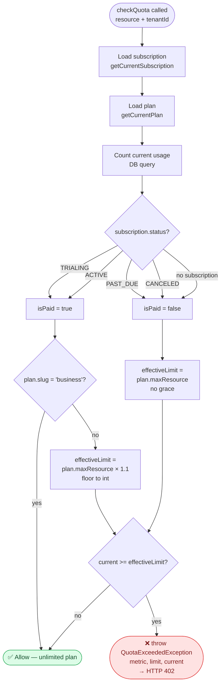
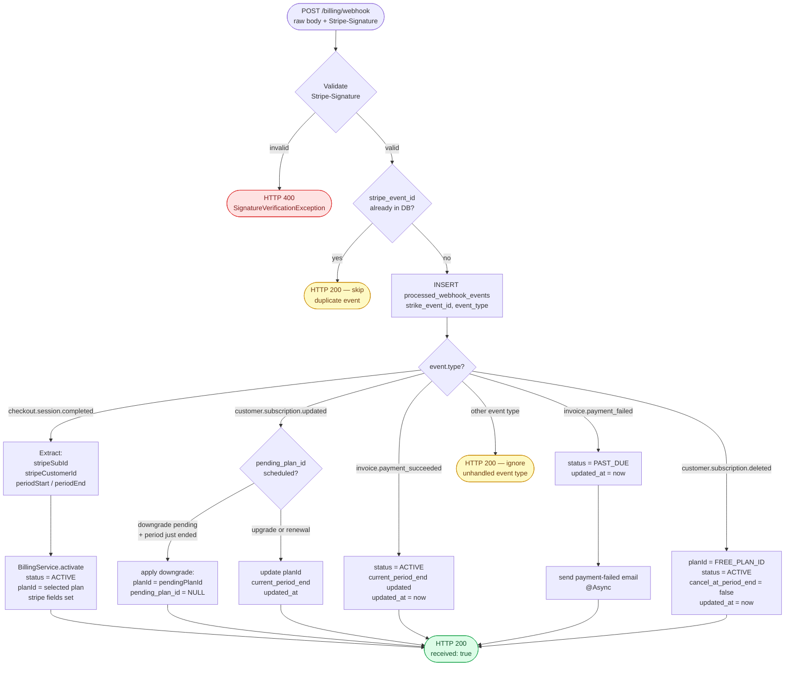
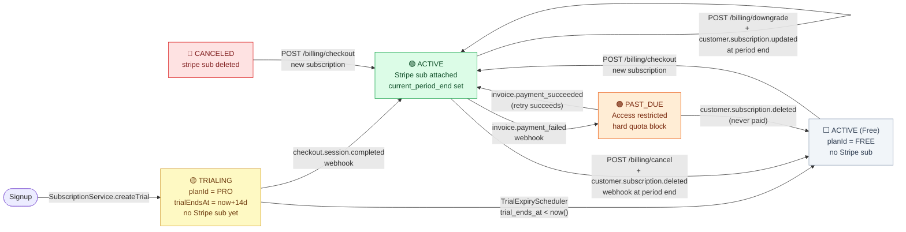

# Flowchart Diagram — M4 Billing

## Overview

Four business logic decision trees that drive M4 behavior: quota enforcement (the most complex, with grace-period branching), webhook event routing, upgrade/downgrade validation, and the full subscription state machine.

---

## Flowchart 1 — Quota Enforcement (QuotaServiceImpl)



---

## Flowchart 2 — Webhook Event Router (WebhookController)



---

## Flowchart 3 — Upgrade / Downgrade Validation (BillingServiceImpl)

```mermaid
flowchart TD
    REQ([POST /billing/upgrade\nor /billing/downgrade\n{planSlug}]) --> LOAD[Load current subscription\n+ current plan]

    LOAD --> NOSUB{stripeSubscriptionId\nexists?}
    NOSUB -->|no| NOSUB_FAIL([HTTP 400\nNo active Stripe subscription\nStill on trial without payment])
    NOSUB -->|yes| PLANEXIST{target plan\nexists in DB?}

    PLANEXIST -->|no| PLANFAIL([HTTP 400\nUnknown planSlug])
    PLANEXIST -->|yes| SAME{targetPlan ==\ncurrentPlan?}

    SAME -->|yes| SAMEFAIL([HTTP 400\nAlready on this plan])
    SAME -->|no| DIR{request type?}

    DIR -->|upgrade| UPGCHECK{targetPlan.priceMonthly >\ncurrentPlan.priceMonthly?}
    UPGCHECK -->|no| UPGFAIL([HTTP 400\nTarget plan is not higher])
    UPGCHECK -->|yes| UPG[StripeService.updateSubscription\nstripeSubId, newPriceId\nprorate = true\nCharge diff immediately]
    UPG --> UPGOK([HTTP 200\nUpgrade initiated\nDB updated via webhook])

    DIR -->|downgrade| DWNCHECK{targetPlan.priceMonthly <\ncurrentPlan.priceMonthly?}
    DWNCHECK -->|no| DWNFAIL([HTTP 400\nTarget plan is not lower])
    DWNCHECK -->|yes| PENDING{pending_plan_id\nalready set?}

    PENDING -->|yes| PENDFAIL([HTTP 400\nDowngrade already pending])
    PENDING -->|no| DWN[StripeService.scheduleSubscriptionUpdate\nstripeSubId, newPriceId\nNo immediate charge]
    DWN --> DWNDB[DB: pending_plan_id = targetPlanId]
    DWNDB --> DWNOK([HTTP 200\nDowngrade scheduled\neffectiveAt = currentPeriodEnd])

    style UPGOK fill:#dcfce7,stroke:#16a34a,color:#14532d
    style DWNOK fill:#dcfce7,stroke:#16a34a,color:#14532d
    style NOSUB_FAIL fill:#fee2e2,stroke:#dc2626,color:#7f1d1d
    style PLANFAIL fill:#fee2e2,stroke:#dc2626,color:#7f1d1d
    style SAMEFAIL fill:#fee2e2,stroke:#dc2626,color:#7f1d1d
    style UPGFAIL fill:#fee2e2,stroke:#dc2626,color:#7f1d1d
    style DWNFAIL fill:#fee2e2,stroke:#dc2626,color:#7f1d1d
    style PENDFAIL fill:#fee2e2,stroke:#dc2626,color:#7f1d1d
```

---

## Flowchart 4 — Subscription State Machine



## Key Notes

- **Flowchart 1 (Quota):** `TRIALING` counts as paid (gets 10% grace). `PAST_DUE` is treated identically to `Free` — hard block at limit. `business` plan short-circuits to allow before any count is loaded.
- **Flowchart 2 (Webhook):** The `UNIQUE` constraint on `stripe_event_id` is the safety net — even if two threads both pass the `existsByStripeEventId` check concurrently, only one `INSERT` succeeds; the other gets a `DataIntegrityViolationException` which the controller catches and treats as a skip.
- **Flowchart 3 (Upgrade/Downgrade):** Upgrade and downgrade are validated by comparing `priceMonthly` — not by ordinal/rank — to keep the logic decoupled from plan ordering assumptions.
- **Flowchart 4 (State machine):** There is no direct `TRIALING → CANCELED` transition. A trial that is never converted simply expires via the scheduler (→ `FREE`). The `CANCELED` state is only reached via Stripe's `customer.subscription.deleted` event.
- **`ACTIVE` self-loop on upgrade/downgrade** — these transitions keep `status = ACTIVE`; only `planId` (and optionally `pending_plan_id`) changes. Status does not change during plan switches.
