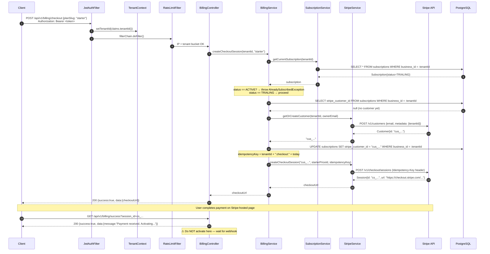
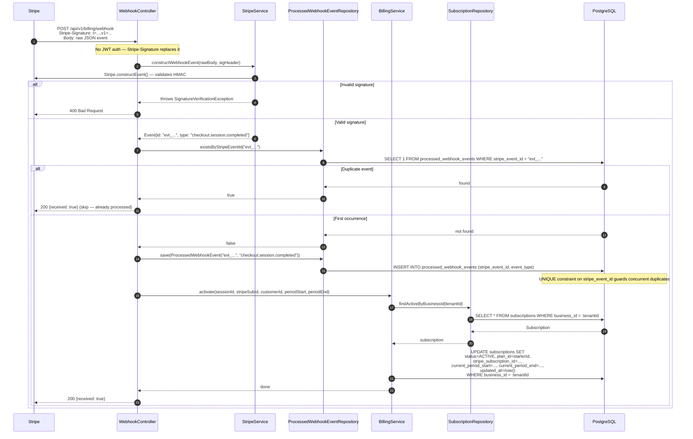
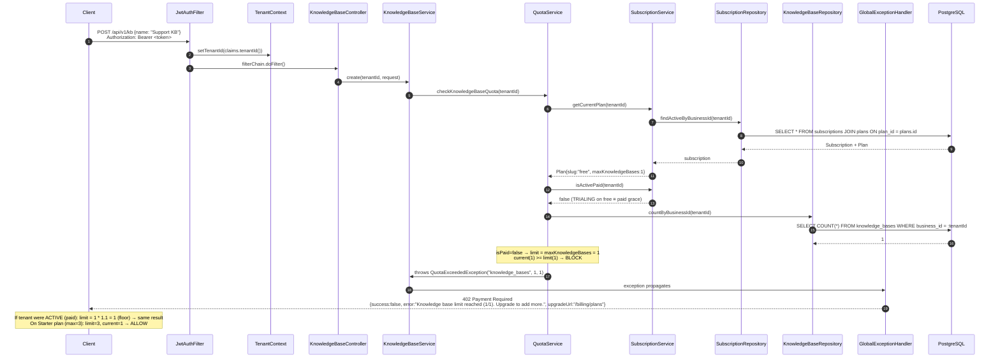
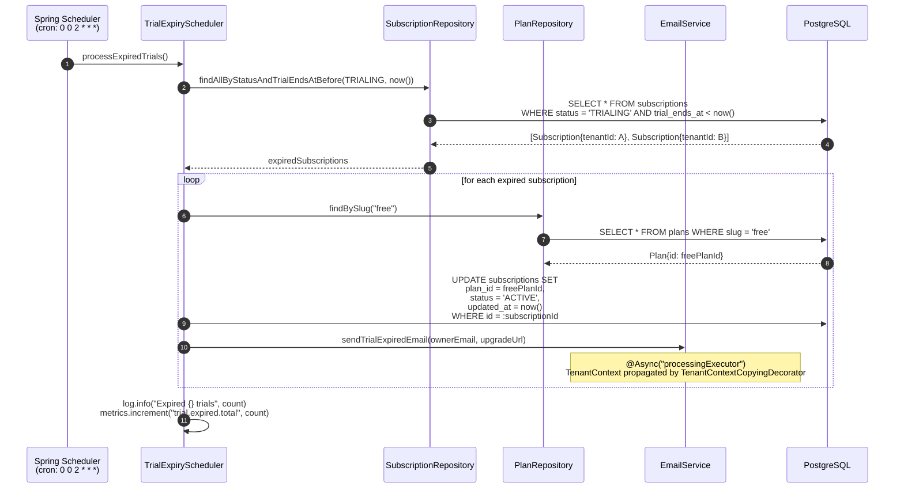
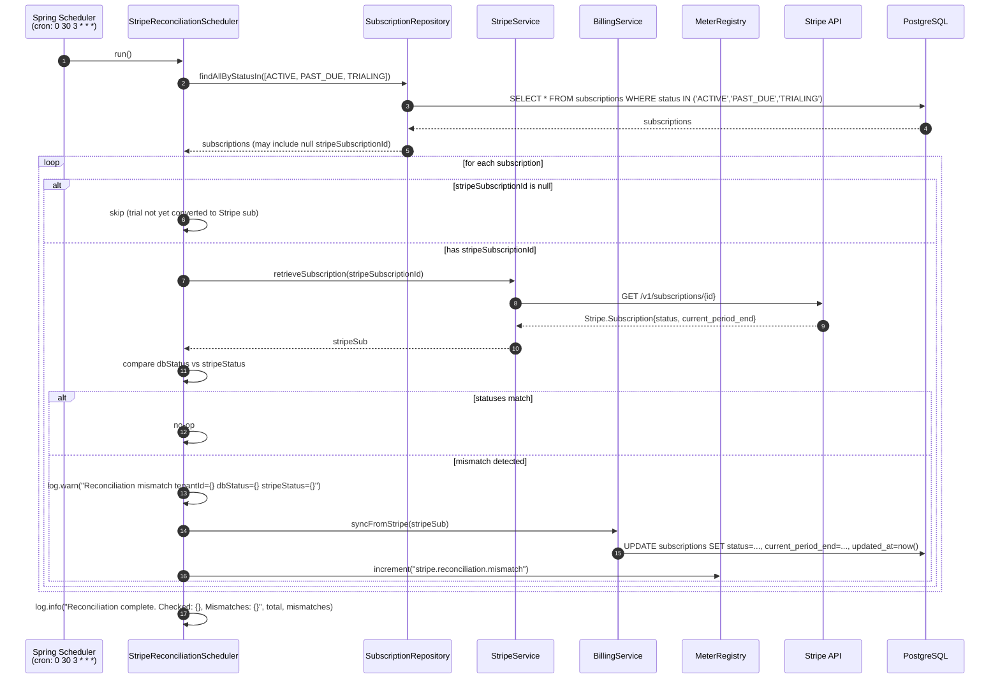

# Sequence Diagram — M4 Billing

## Overview

Shows the four critical runtime flows for M4 billing: (1) Stripe Checkout session creation, (2) Webhook event processing with idempotency, (3) Quota enforcement on resource creation, and (4) the two scheduled jobs (trial expiry + reconciliation).

---

## Flow 1 — Stripe Checkout (Subscribe to a Plan)

---

## Flow 2 — Stripe Webhook Processing (Activation + Idempotency)

---

## Flow 3 — Quota Enforcement (Knowledge Base Creation)

---

## Flow 4 — Trial Expiry Scheduler (02:00 daily)

---

## Flow 5 — Reconciliation Scheduler (03:30 daily)

## Key Notes

- **Flow 1 + 2 are always paired** — the checkout API creates the Stripe session; `GET /billing/success` only acknowledges receipt. The DB update only happens in Flow 2 (webhook). Never activate on the success redirect.
- **Idempotency in Flow 2** runs at two levels: `existsByStripeEventId` check (application level) + `UNIQUE` DB constraint (database level). The constraint catches concurrent duplicate deliveries that both pass the application check.
- **Flow 3 quota logic** — `isPaid=true` → limit = `max * 1.1` (10% grace); `isPaid=false` or `PAST_DUE` → limit = `max` exactly (hard block). `TRIALING` counts as paid.
- **Flow 4 (02:00) runs before Flow 5 (03:30)** — this ordering is intentional. Trials are expired first so reconciliation sees the correct `ACTIVE` (Free) status, not `TRIALING`.
- **TenantContext in schedulers** — schedulers are not HTTP-scoped, so `TenantContext` is `null`. Repositories called from schedulers must use native queries that bypass the Hibernate tenant filter (as in `SubscriptionRepository.findActiveByBusinessId`).
- **Email in Flow 4 is `@Async`** — uses `processingExecutor` bean wired with `TenantContextCopyingDecorator`. If the tenant context is needed in the email task, it must be captured before the async handoff.
