# Use Case Diagram — M4 Billing + Production Hardening

## Overview

Shows all actors interacting with the M4 billing subsystem and the use cases available to each. Derived from SRS FR-001 → FR-038 and the six use cases (UC-001 → UC-006).

## Diagram

```mermaid
flowchart TB
    %% ── Actors ────────────────────────────────────────────
    BO(["👤 Business Owner\n(ADMIN)"])
    MB(["👤 Member"])
    EU(["👥 End User\n(widget / PUBLIC)"])
    ST(["⚡ Stripe\n(external)"])
    TES(["⏱ TrialExpiryScheduler\n(system, 02:00 daily)"])
    REC(["⏱ ReconciliationScheduler\n(system, 03:30 daily)"])

    %% ── Billing subsystem ─────────────────────────────────
    subgraph BILLING ["💳 Billing"]
        UC1["View plan catalogue\nGET /billing/plans"]
        UC2["View current subscription\nGET /billing/subscription"]
        UC3["Start Stripe Checkout\nPOST /billing/checkout"]
        UC4["Upgrade plan\nPOST /billing/upgrade"]
        UC5["Schedule downgrade\nPOST /billing/downgrade"]
        UC6["Cancel subscription\nPOST /billing/cancel"]
        UC7["Receive Stripe webhook\nPOST /billing/webhook"]
        UC8["Expire trial → downgrade to Free"]
        UC9["Reconcile DB ↔ Stripe"]
    end

    %% ── Quota enforcement ─────────────────────────────────
    subgraph QUOTA ["🔒 Quota Enforcement"]
        UC10["Create knowledge base\n(quota checked)"]
        UC11["Upload document\n(quota checked)"]
        UC12["Send chat message\n(quota checked)"]
    end

    %% ── Rate limiting ─────────────────────────────────────
    subgraph RATE ["🛡 Rate Limiting"]
        UC13["IP-based rate limit\n(auth / widget / general)"]
        UC14["Tenant-based rate limit\n(per plan)"]
    end

    %% ── Observability ─────────────────────────────────────
    subgraph OBS ["📊 Observability"]
        UC15["Health probes\n/health/liveness\n/health/readiness"]
        UC16["Prometheus metrics\n/actuator/prometheus"]
        UC17["Structured MDC logs\n(tenantId, requestId, userId)"]
    end

    %% ── Actor → Use Case connections ──────────────────────
    BO --> UC1
    BO --> UC2
    BO --> UC3
    BO --> UC4
    BO --> UC5
    BO --> UC6

    MB --> UC2
    MB --> UC10
    MB --> UC11
    MB --> UC12

    EU --> UC13

    BO --> UC10
    BO --> UC11
    BO --> UC12

    ST --> UC7

    TES --> UC8
    REC --> UC9

    %% ── Extends / includes ────────────────────────────────
    UC3 -. "«include»\nidempotency key" .-> UC7
    UC4 -. "«include»\nStripe proration" .-> UC7
    UC5 -. "«include»\nsets pending_plan_id" .-> UC7
    UC6 -. "«include»\ncancel_at_period_end" .-> UC7

    UC10 -. "«extend»\n402 if over quota" .-> QUOTA
    UC11 -. "«extend»\n402 if over quota" .-> QUOTA
    UC12 -. "«extend»\n402 if over quota" .-> QUOTA

    UC13 -. "«extend»\n429 if exceeded" .-> RATE
    UC14 -. "«extend»\n429 if exceeded" .-> RATE

    %% ── Styling ───────────────────────────────────────────
    classDef actor fill:#dbeafe,stroke:#3b82f6,color:#1e3a8a
    classDef usecase fill:#f0fdf4,stroke:#22c55e,color:#14532d
    classDef system fill:#fef9c3,stroke:#ca8a04,color:#713f12

    class BO,MB,EU actor
    class ST,TES,REC system
```

## Actors

| Actor | Type | Description |
|-------|------|-------------|
| Business Owner | Human (ADMIN JWT) | Manages billing — subscribe, upgrade, downgrade, cancel |
| Member | Human (MEMBER JWT) | Consumes quota-controlled resources (KBs, docs, chat) |
| End User | Human (PUBLIC) | Widget user; subject to IP rate limiting only |
| Stripe | External system | Sends signed webhook events to activate/update/cancel subscriptions |
| TrialExpiryScheduler | System (cron) | Runs at 02:00 daily; downgrades expired trials to Free |
| ReconciliationScheduler | System (cron) | Runs at 03:30 daily; syncs DB subscription state against Stripe |

## Key Notes

- All billing-write use cases (UC3–UC6) are **ADMIN-only** — Members cannot manage billing
- Webhook (UC7) is the **single activation path** — checkout success, upgrades, downgrades, and cancellations all resolve via webhook, never via the initiating API call
- Quota enforcement applies to **both ADMIN and MEMBER** roles on resource-creation endpoints
- Rate limiting is **transparent** — all actors are subject to it at the filter layer before any use case executes
- The two scheduler actors have **no JWT** — they run as internal Spring beans, not through the HTTP stack
