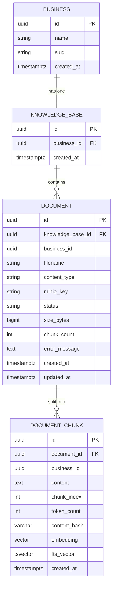
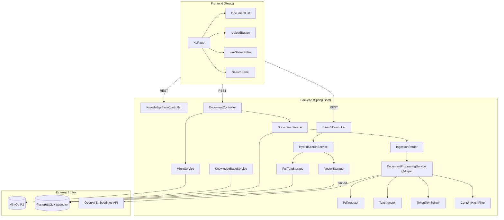
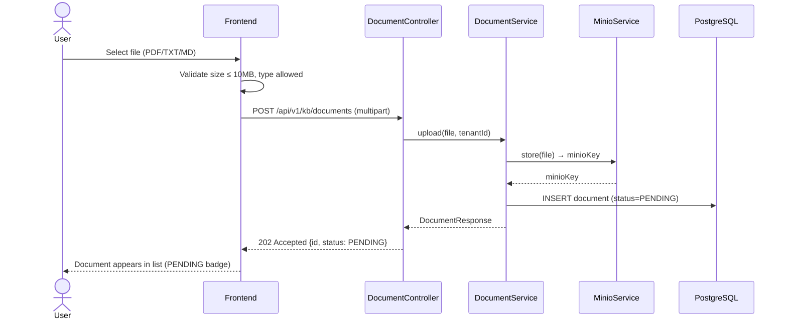
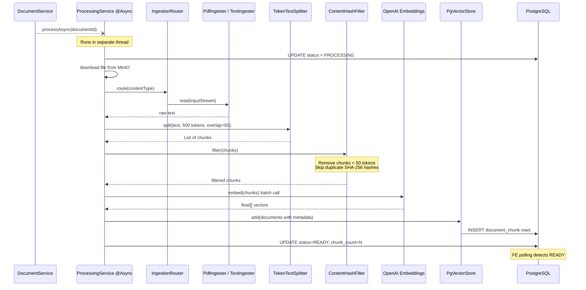
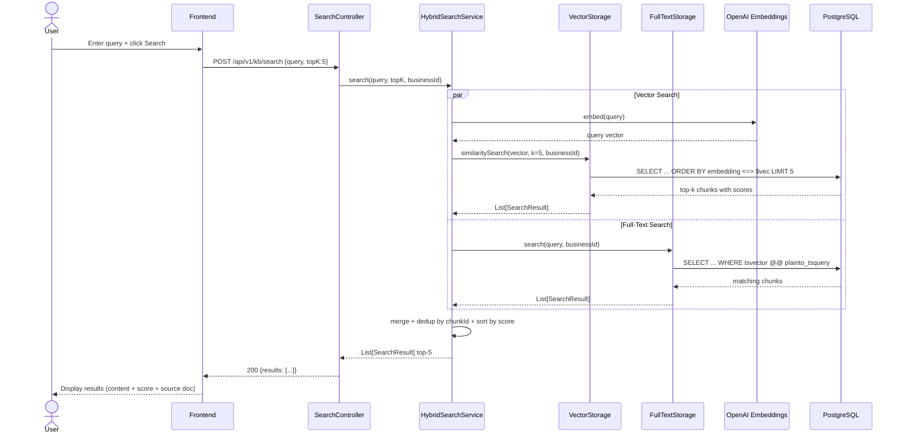

# M2 High-Level Design — Knowledge Base & RAG

**Date:** 2026-05-17  
**Milestone:** M2 — Knowledge Base & RAG Pipeline  
**Status:** Approved

---

## 1. Entity Relationship Diagram

**Key constraints:**
- `KNOWLEDGE_BASE.business_id` — UNIQUE (one KB per tenant)
- `DOCUMENT_CHUNK.embedding` — type `vector(1536)` (OpenAI text-embedding-3-small)
- `DOCUMENT_CHUNK.content_hash` — UNIQUE per `business_id` (SHA-256 dedup)
- `DOCUMENT_CHUNK.fts_vector` — GIN index for full-text search
- IVFFlat index on `embedding` for approximate nearest-neighbor search

---

## 2. Component Diagram

---

## 3. Sequence Diagrams

### 3a. Document Upload Flow

### 3b. Async Processing Flow

### 3c. RAG Search Flow

---

## 4. Technology Stack Decisions

| Layer | Technology | Rationale |
|---|---|---|
| File storage | MinIO (dev) / Cloudflare R2 (prod) | S3-compatible, open-source, free tier |
| Vector DB | pgvector extension on PostgreSQL | No extra infra, leverages existing PG |
| Embeddings | OpenAI text-embedding-3-small (1536 dim) | Fixed dim for both dev/prod; $5 cap on dev key |
| Text splitting | Spring AI TokenTextSplitter (500 tok, overlap 50) | Semantic coherence with overlap context |
| FTS | PostgreSQL tsvector + plainto_tsquery | Built-in, no Elasticsearch needed for MVP |
| Async processing | Spring `@Async` with dedicated thread pool | Simple, no Kafka/Redis needed for MVP |
| Ingestion abstraction | `DocumentIngester` interface | Extensible: VideoIngester, CsvIngester future |
| Storage abstraction | `StorageStrategy` interface | Swappable: VectorStorage, FullTextStorage |

---

## 5. Database Migrations

| Migration | Content |
|---|---|
| V13 | `CREATE EXTENSION pgvector` + `knowledge_base` table |
| V14 | `document` table (status enum, minio_key, size_bytes) |
| V15 | `document_chunk` table: `vector(1536)`, IVFFlat index, tsvector GIN index, content_hash UNIQUE |

---

## 6. Multi-Tenancy

All queries filtered by `business_id` via existing Hibernate tenant filter (`TenantContext`). Documents and chunks inherit `business_id` at INSERT time — no cross-tenant data leakage possible at the ORM layer.
